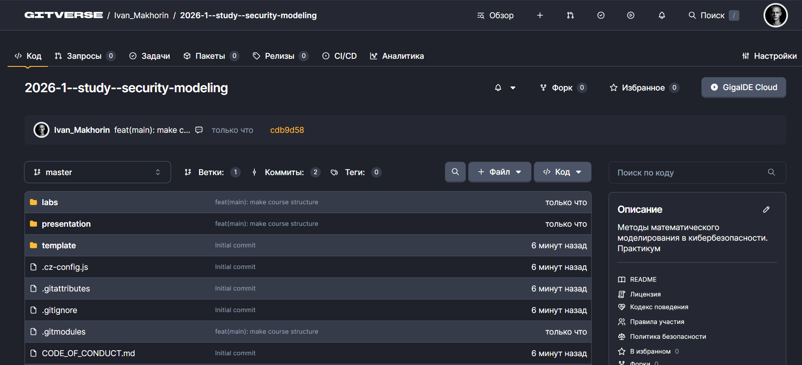
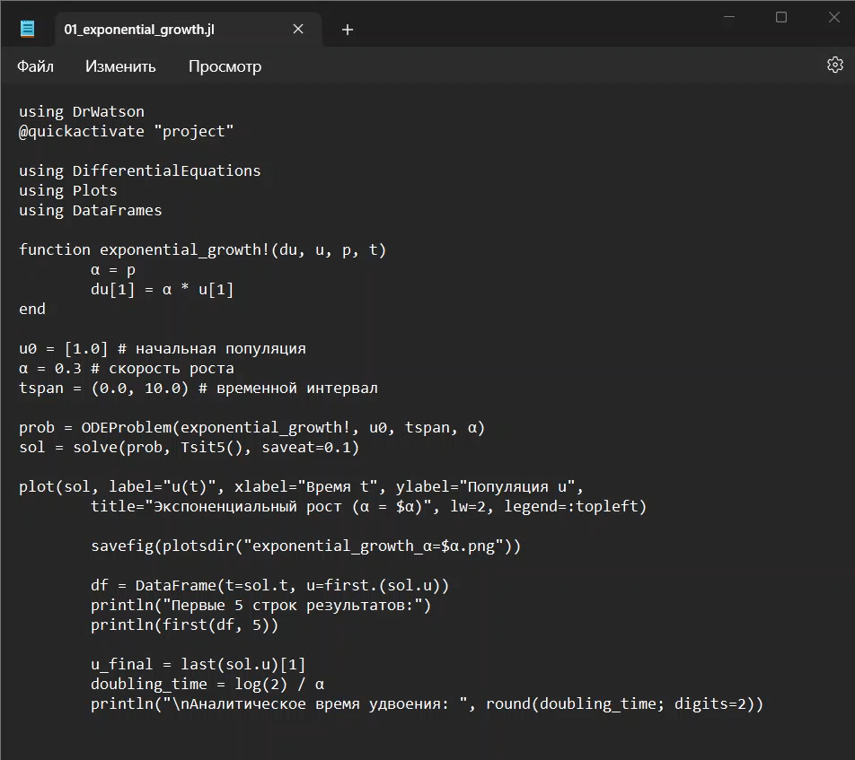
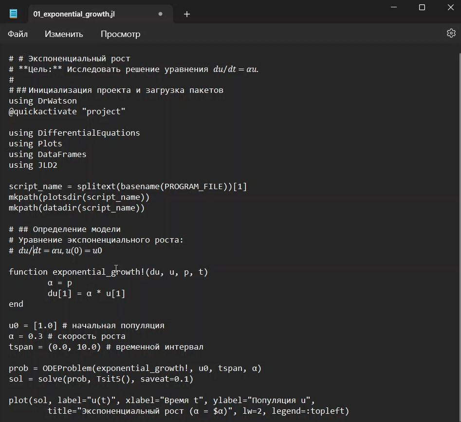
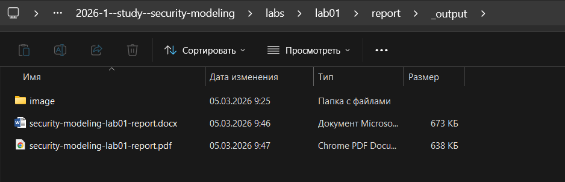

---
# Preamble

## Author
author:
  name: Махорин Иван Сергеевич
  degrees: BSc
  orcid: 0009-0005-2255-4025
  email: 1032259380@rudn.ru
  affiliation:
    - name: Российский университет дружбы народов
      country: Российская Федерация
      postal-code: 117198
      city: Москва
      address: ул. Миклухо-Маклая, д. 6
## Title
title: "Лабораторная работа №1"
subtitle: "Основы литературного программирования"
license: "CC BY"
date: 2026-03-06
## Generic options
lang: ru-RU
crossref:
  lof-title: Список иллюстраций
  lot-title: Список таблиц
  lol-title: Листинги
## Formats
format:
### Pdf output format
  beamer:
    toc: false
    toc-title: Содержание
    number-sections: true
    colorlinks: false
    toc-depth: 2
    slide_level: 2
    aspectratio: 169
    section-titles: true
    theme: metropolis
    themeoptions: progressbar=frametitle,sectionpage=progressbar,numbering=fraction
#### Language
    babel-lang: russian
    babel-otherlangs: english
### Html output
  revealjs:
    transition: slide
    margin: 0.2
    smaller: false
    output-ext: html
    theme: beige
    logo: _resources/image/logo_rudn.png
---

# Информация

## Докладчик

:::::::::::::: {.columns align=center}
::: {.column width="70%"}

  * Махорин Иван Сергеевич
  * студент группы НФИмд-02-25
  * Российский университет дружбы народов им. П. Лумумбы
  * [1032259380@rudn.ru](mailto:1032259380@rudn.ru)
  * <https://github.com/Ivan-Makhorin>

:::
::: {.column width="30%"}

:::
::::::::::::::

# Введение

## Цель работы

Освоить методологию литературного программирования и современные инструменты (Git, DrWatson, Literate.jl, Quarto) для создания воспроизводимых научных отчётов в области кибербезопасности на примере модели экспоненциального роста.

## Задачи лабораторной работы

- Создать рабочее пространство.
- Установить необходимые пакеты.
- Выполнить предложенный код и преобразовать его в литературный стиль.
- Выполнить генерацию из литературного кода.
- Выполнить код из jupyter notebook.
- Интегрировать документацию в формате Quarto в отчёт.
- Добавить в код в литературном стиле вычисление для набора параметров.
- Выполнить генерацию из литературного кода с параметрами.
- Выполнить код из jupyter notebook с параметрами.
- Интегрировать документацию с параметрами в формате Quarto в отчёт.

# Ход выполнения лабораторной работы

## Размещение рабочего каталога

{#fig-001 width=70%}

## Размещение рабочего каталога

{#fig-002 width=70%}

## Работа с кодом

{#fig-003 width=45%}

## Работа с кодом

{#fig-004 width=45%}

## Работа с кодом

{#fig-005 width=70%}

## Работа с кодом

{#fig-006 width=70%}

## Работа с документацией

{#fig-007 width=70%}

## Работа с кодом с параметрами

{#fig-008 width=45%}

## Работа с кодом с параметрами

{#fig-009 width=70%}

## Работа с кодом с параметрами

{#fig-010 width=70%}

## Работа с документацией

{#fig-011 width=70%}

# Выводы

В ходе лабораторной работы создана структурированная инфраструктура проекта, освоены инструменты воспроизводимых исследований (DrWatson.jl, Literate.jl). Реализована модель экспоненциального роста, проведено параметрическое исследование. Применение литературного программирования позволило объединить код, описание и результаты, а также сгенерировать чистый код, Jupyter Notebook и документацию Quarto, интегрированную в итоговый отчёт.

# Список литературы

1. JuliaLang [Электронный ресурс]. 2024 JuliaLang.org contributors. URL: https: //julialang.org/ (дата обращения: 05.03.2025).
2. Julia 1.11 Documentation [Электронный ресурс]. 2024 JuliaLang.org contributors. URL: https://docs.julialang.org/en/v1/ (дата обращения: 05.03.2025).