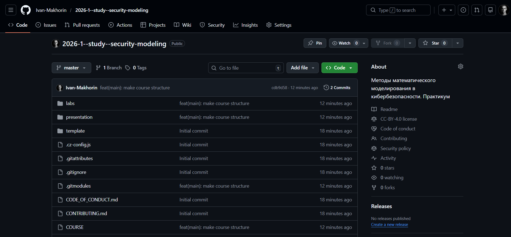
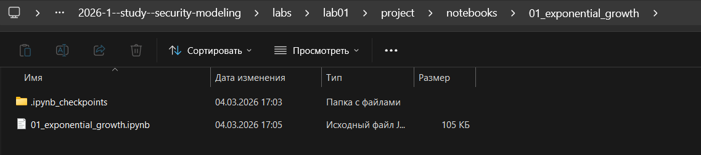
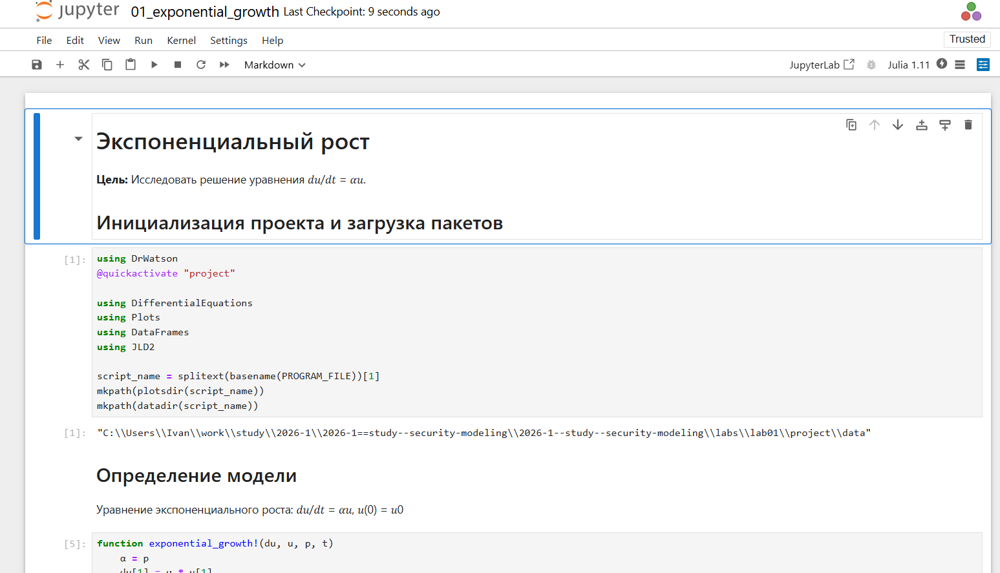
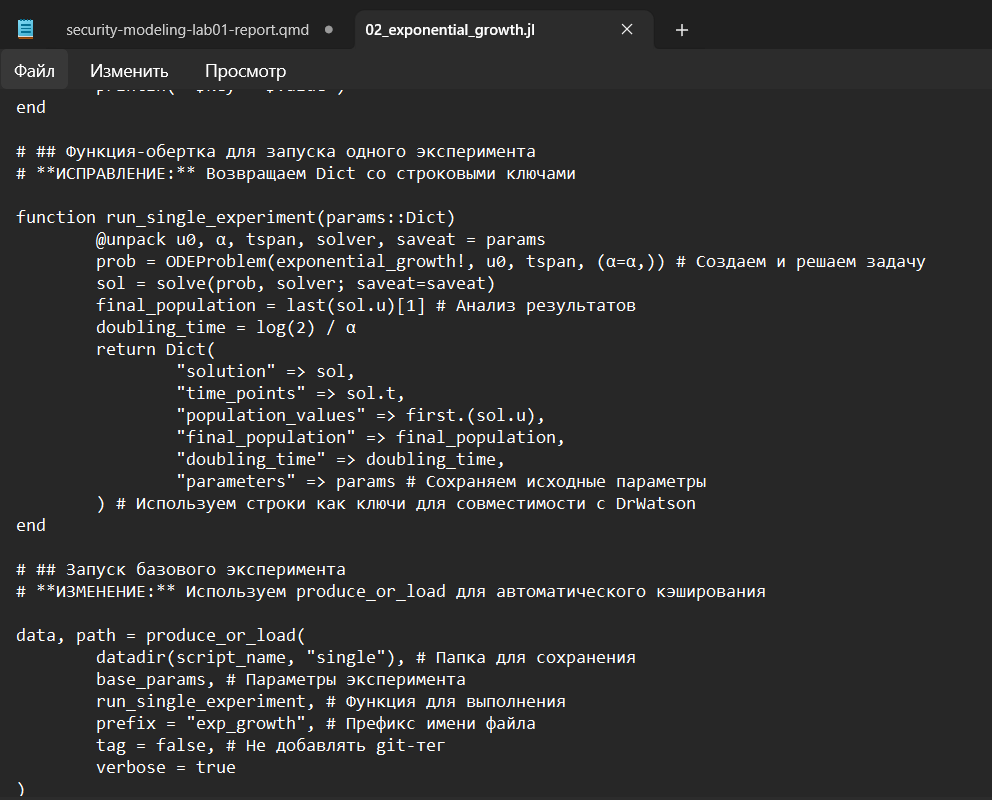
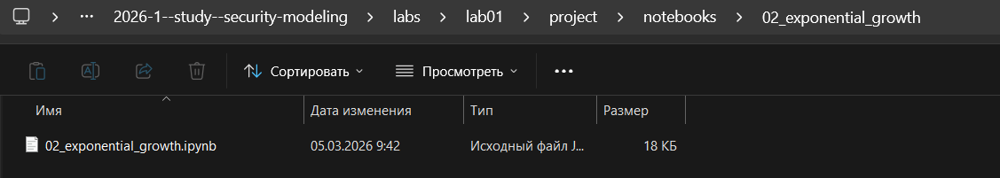
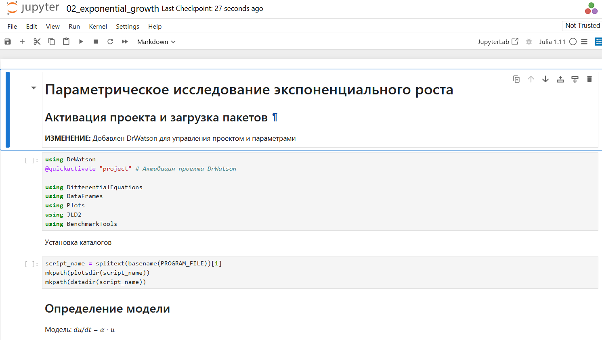
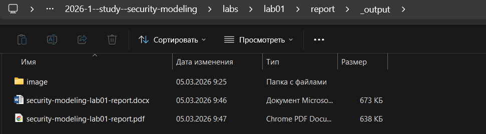

---
## Author
author:
  name: Махорин Иван Сергеевич
  degrees: BSc
  orcid: 0000-0002-0877-7063
  email: 1032259380@rudn.ru
  affiliation:
    - name: Российский университет дружбы народов
      country: Российская Федерация
      postal-code: 117198
      city: Москва
      address: ул. Миклухо-Маклая, д. 6

## Title
title: "Отчёт по лабораторной работе №1"
subtitle: "Основы литературного программирования"
license: "CC BY"
---

# Цель работы

Освоить методологию литературного программирования и современные инструменты (Git, DrWatson, Literate.jl, Quarto) для создания воспроизводимых научных отчётов в области кибербезопасности на примере модели экспоненциального роста.

# Задание

### Задачи лабораторной работы

- Создать рабочий каталог для всего курса.
- Создать рабочее пространство для программ в рамках лабораторной работы.
- Выполнить все задания по тексту лабораторной работы.
- Установить необходимые пакеты.
- Выполнить предложенный код.
- Преобразовать код в литературный стиль.
- Сгенерировать из литературного кода:
  - чистый код;
  - jupyter notebook;
  - документацию в формате Quarto.
- Выполнить код из jupyter notebook.
- Интегрировать документацию в формате Quarto в отчёт.
- Добавить в код в литературном стиле вычисление для набора параметров.
- Сгенерировать из литературного кода с параметрами:
  - чистый код;
  - jupyter notebook;
  - документацию в формате Quarto.
- Выполнить код из jupyter notebook с параметрами.
- Интегрировать документацию с параметрами в формате Quarto в отчёт.

# Теоретическое введение

Теоретическое введение базируется на двух ключевых концепциях: математическом моделировании и литературном программировании.

**Математическое моделирование** рассматривается как междисциплинарный подход, объединяющий теорию, вычислительный эксперимент и анализ. В качестве базовой модели для изучения предлагается модель экспоненциального роста, описываемая дифференциальным уравнением. Эта модель широко применяется в различных областях — от биологии до кибербезопасности (например, для описания распространения инфекций или роста трафика).

**Литературное программирование** (по Д. Кнуту) представляет собой методологию создания программ, где код сопровождается подробным описанием на естественном языке, что делает программу понятной для человека в первую очередь. Для реализации этого подхода в экосистеме Julia предлагается использовать пакет `Literate.jl`, который позволяет преобразовывать скрипты с комментариями в различные форматы: исполняемый код, Jupyter Notebook и документацию Quarto.

Для организации воспроизводимых научных проектов применяется фреймворк `DrWatson.jl`, обеспечивающий стандартизированную структуру каталогов, управление параметрами и сохранение результатов. В совокупности с системами контроля версий (`Git`) и стандартами оформления коммитов это создаёт основу для прозрачных и воспроизводимых исследований.

# Выполнение лабораторной работы

Для начала создадим рабочий каталог для всего курса, а также рабочее пространство для программ в рамках лабораторной работы. После чего разместим это на GitVerse ([рис. @fig-001]) и GitHub ([рис. @fig-002]):

{#fig-001 width=70%}

{#fig-002 width=70%}

Теперь приступим к выполнению всех заданий по тексту лабораторной работы и установим необходимые пакеты.

Выполним предложенный код ([рис. @fig-003]):

{#fig-003 width=70%}

Преобразуем код в литературный стиль ([рис. @fig-004]):

{#fig-004 width=70%}

Затем сгенерируем из литературного кода: чистый код, jupyter notebook, документацию в формате Quarto ([рис. @fig-005]):

{#fig-005 width=70%}

Выполним код из jupyter notebook ([рис. @fig-006]):

{#fig-006 width=70%}

Следующим шагом интегрируем документацию в формате Quarto в отчёт ([рис. @fig-007]):

{#fig-007 width=70%}

Добавим в код в литературном стиле вычисление для набора параметров ([рис. @fig-008]):

{#fig-008 width=70%}

Сгенерируем из литературного кода с параметрами: чистый код, jupyter notebook, документацию в формате Quarto ([рис. @fig-009]):

{#fig-009 width=70%}

Выполним код из jupyter notebook с параметрами ([рис. @fig-010]):

{#fig-010 width=70%}

Последним шагом интегрируем документацию с параметрами в формате Quarto в отчёт ([рис. @fig-011]):

{#fig-011 width=70%}




# Выводы

## Выводы

В ходе лабораторной работы создана структурированная инфраструктура проекта, освоены инструменты воспроизводимых исследований (DrWatson.jl, Literate.jl). Реализована модель экспоненциального роста, проведено параметрическое исследование. Применение литературного программирования позволило объединить код, описание и результаты, а также сгенерировать чистый код, Jupyter Notebook и документацию Quarto, интегрированную в итоговый отчёт.

# Список литературы{.unnumbered}

::: {#refs}
:::
