---
# Preamble

## Author
author:
  name: Махорин Иван Сергеевич
  degrees: BSc
  orcid: 0009-0005-2255-4025
  email: 1032259380@rudn.ru
  affiliation:
    - name: Российский университет дружбы народов
      country: Российская Федерация
      postal-code: 117198
      city: Москва
      address: ул. Миклухо-Маклая, д. 6
## Title
title: "Лабораторная работа №2"
subtitle: "Основы вероятностного моделирования угроз"
license: "CC BY"
date: 2026-04-04
## Generic options
lang: ru-RU
crossref:
  lof-title: Список иллюстраций
  lot-title: Список таблиц
  lol-title: Листинги
## Formats
format:
### Pdf output format
  beamer:
    toc: false
    toc-title: Содержание
    number-sections: true
    colorlinks: false
    toc-depth: 2
    slide_level: 2
    aspectratio: 169
    section-titles: true
    theme: metropolis
    themeoptions: progressbar=frametitle,sectionpage=progressbar,numbering=fraction
#### Language
    babel-lang: russian
    babel-otherlangs: english
### Html output
  revealjs:
    transition: slide
    margin: 0.2
    smaller: false
    output-ext: html
    theme: beige
    logo: _resources/image/logo_rudn.png
---

# Информация

## Докладчик

:::::::::::::: {.columns align=center}
::: {.column width="70%"}

  * Махорин Иван Сергеевич
  * студент группы НФИмд-02-25
  * Российский университет дружбы народов им. П. Лумумбы
  * [1032259380@rudn.ru](mailto:1032259380@rudn.ru)
  * <https://github.com/Ivan-Makhorin>

:::
::: {.column width="30%"}

:::
::::::::::::::

# Введение

## Цель работы

Освоить базовые методы вероятностного моделирования случайных процессов в контексте кибербезопасности на примере моделирования потока атак на веб-сервер, включая генерацию случайных величин с заданным распределением, статистический анализ смоделированных данных, проверку соответствия эмпирического распределения теоретическому, оценку вероятностей редких событий, определение набора параметров модели (интенсивность атак, длительность наблюдения и т.д.), реализацию симуляции пуассоновского потока атак, выполнение статистического анализа результатов, визуализацию данных и проверку соответствия теоретическим распределениям.

## Задачи лабораторной работы

1. Создать проект DrWatson с именем project.
2. Определить набор параметров модели (словарь params) с возможностью варьирования.
3. Написать функцию simulate_attacks(params), которая возвращает структуру с результатами симуляции (например, массив числа атак по часам, интервалы, моменты времени).
4. Использовать produce_or_load для запуска симуляции с заданными параметрами и сохранения результатов на диск.
5. Провести серию экспериментов с разными значениями параметров (например, разные $\lambda$, разная длительность).
6. Загрузить сохранённые результаты и выполнить:
    - построение гистограммы числа атак за час и сравнение с теоретическим распределением Пуассона;
    - построение графика накопленного числа атак и интервалов между атаками;
    - проверку экспоненциальности интервалов (гистограмма, QQ-plot, возможно критерий согласия);
    - оценку вероятности события «более 10 атак за час» теоретически и эмпирически.
7. Проанализировать зависимость точности оценки вероятности от числа симуляций.

# Ход выполнения лабораторной работы

## Проект DrWatson

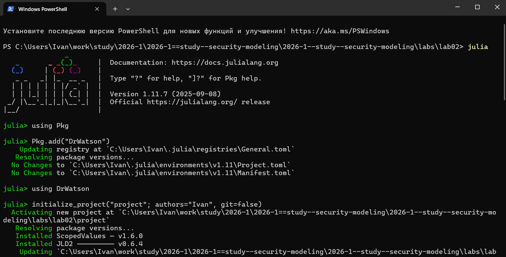{#fig-001 width=70%}

## Установка пакетов

{#fig-002 width=40%}

## Словарь params

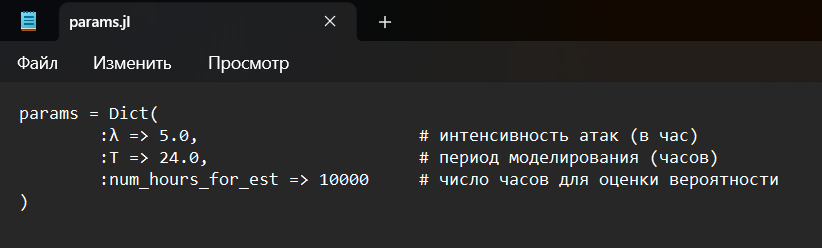{#fig-003 width=70%}

## Написание скрипта

{#fig-004 width=50%}

## Написание скрипта

{#fig-005 width=40%}

## Написание скрипта

{#fig-006 width=40%}

## Выполнение скрипта

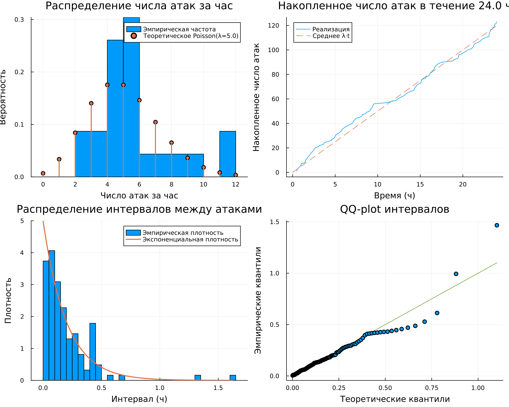{#fig-007 width=50%}

## Написание скрипта

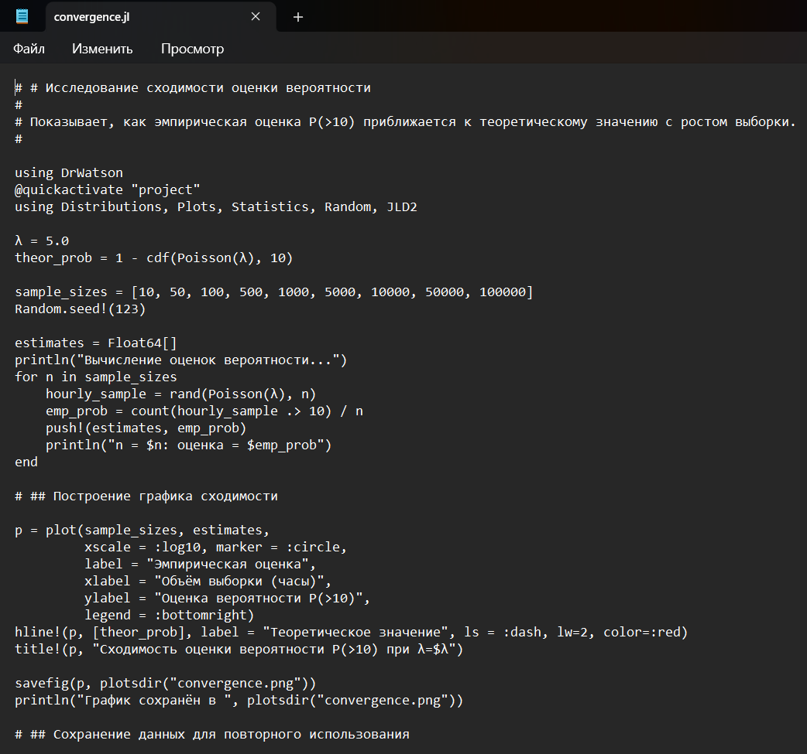{#fig-008 width=40%}

## Выполнение скрипта

{#fig-009 width=50%}

## Написание скрипта

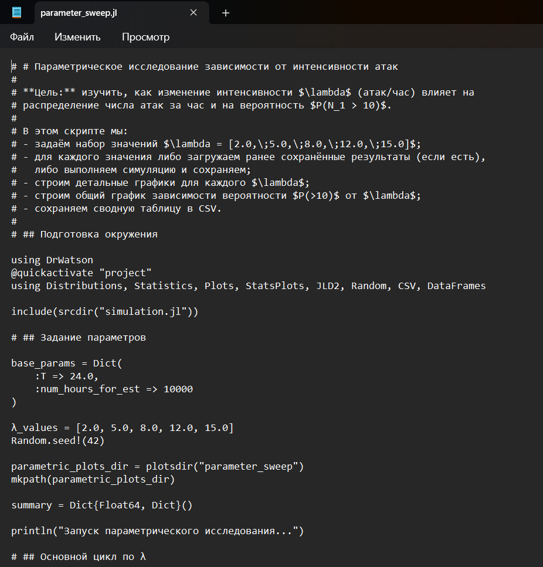{#fig-010 width=40%}

## Выполнение скрипта

{#fig-011 width=50%}

## Выполнение скрипта

{#fig-012 width=50%}

## Выполнение скрипта

{#fig-013 width=50%}

## Выполнение скрипта

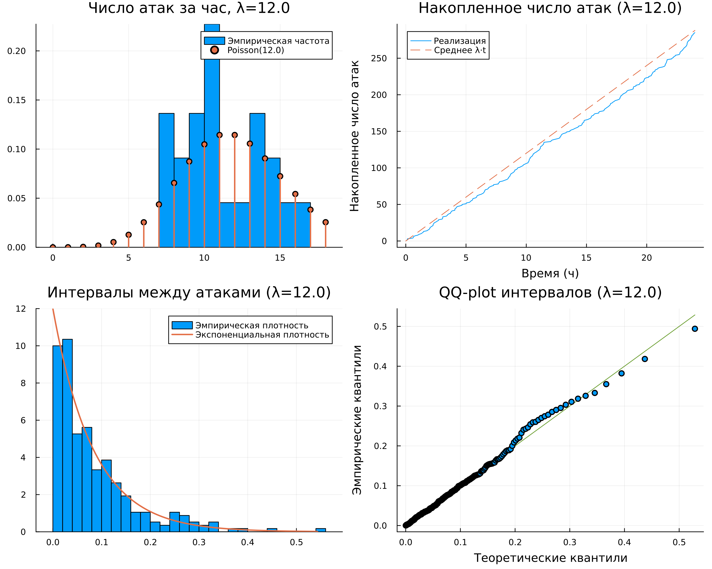{#fig-014 width=50%}

## Выполнение скрипта

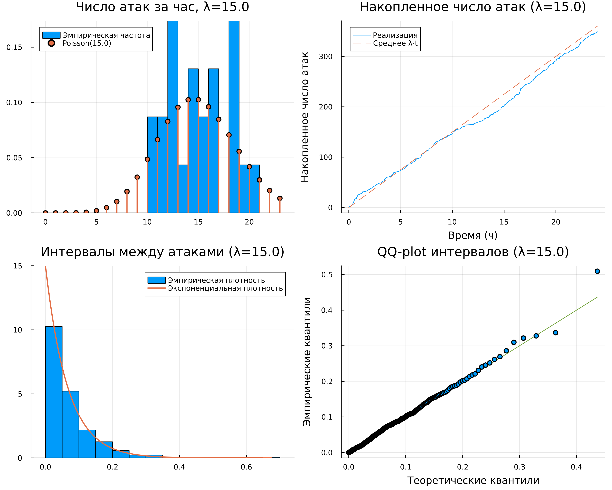{#fig-015 width=50%}

## Выполнение скрипта

{#fig-016 width=50%}

# Ответы на контрольные вопросы

## Ответы на контрольные вопросы

1. Какими свойствами обладает простейший поток событий? Почему он часто используется для моделирования атак?
	- Свойства: стационарность, отсутствие последействия, ординарность. Используется из-за простоты и адекватности реальным потокам атак.
2. Как сгенерировать реализацию пуассоновского потока на интервале времени?
	- Генерация: моделируем экспоненциальные интервалы с параметром λ или генерируем почасовые пуассоновские величины.
3. Как проверить, что интервалы между событиями распределены экспоненциально?
	- Проверка: гистограмма интервалов с наложением теоретической плотности; QQ-plot; критерий Колмогорова-Смирнова.

## Ответы на контрольные вопросы

4. В чём преимущества использования DrWatson для организации вычислительного эксперимента?
	- Преимущества DrWatson: стандартная структура, автоматическое кэширование, генерация имён файлов по параметрам, интеграция с Git, воспроизводимость.
5. Что такое produce_or_load и как он работает?
	- produce_or_load: функция, которая по параметрам проверяет наличие файла; если есть – загружает, иначе вычисляет результат и сохраняет.
6. Какая структура проекта создаётся DrWatson? Для чего нужны папки data, plots, scripts, src?
	- Структура: data/ – результаты, plots/ – графики, scripts/ – скрипты, src/ – библиотеки. Разделение ответственности.
7. Как задать набор параметров для множественных запусков в DrWatson?
	- Задание параметров: через Dict с векторами значений и dict_list или массивом словарей; имена файлов генерируются автоматически.

# Дополнительные задания

## Дополнительные задания

1.  Изменить интенсивность $\lambda$ (например, 2, 8, 12 атак/час) и сравнить результаты.
2.  Моделировать нестационарный пуассоновский поток с интенсивностью, зависящей от времени суток: $\lambda(t) = 2 + 5 \sin(\pi t / 12)$. Модифицировать функцию симуляции (использовать метод прореживания или неоднородный пуассоновский процесс).
3.  Исследовать вероятность события «ни одной атаки за смену (8 часов)» или «не менее 3 атак за 30 минут».
4.  Оценить доверительный интервал для вероятности редкого события методом бутстрепа.
5.  Добавить в модель возможность успешности атаки: каждая атака имеет вероятность успеха $p$, тогда успешные атаки образуют прореженный пуассоновский поток. Модифицировать симуляцию и проанализировать.
6.  Использовать реальные данные об атаках (если предоставлены) и проверить гипотезу о пуассоновости.

## Задание №1

{#fig-017 width=40%}

## Задание №1

{#fig-018 width=60%}

## Задание №2

{#fig-019 width=60%}

## Задание №2

{#fig-020 width=30%}

## Задание №3

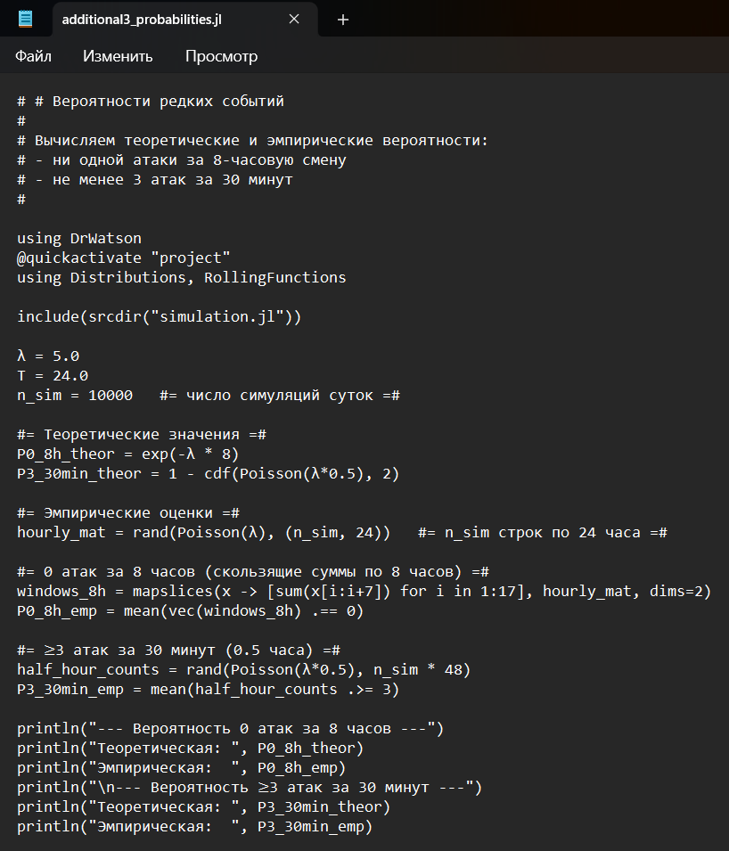{#fig-021 width=30%}

## Задание №3

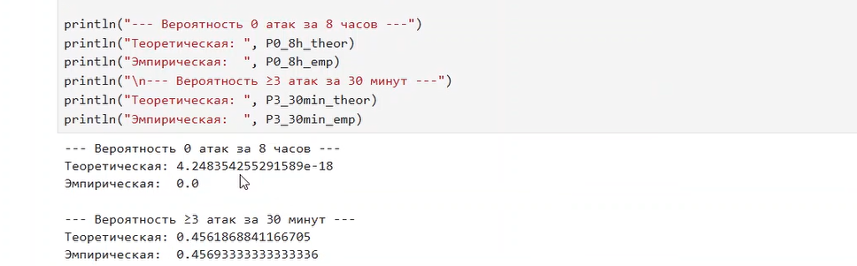{#fig-022 width=70%}

## Задание №4

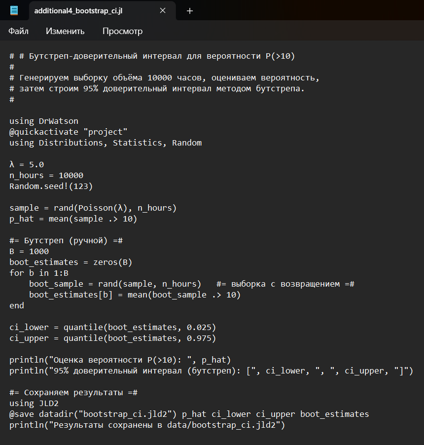{#fig-023 width=40%}

## Задание №4

{#fig-024 width=70%}

## Задание №5

{#fig-025 width=40%}

## Задание №5

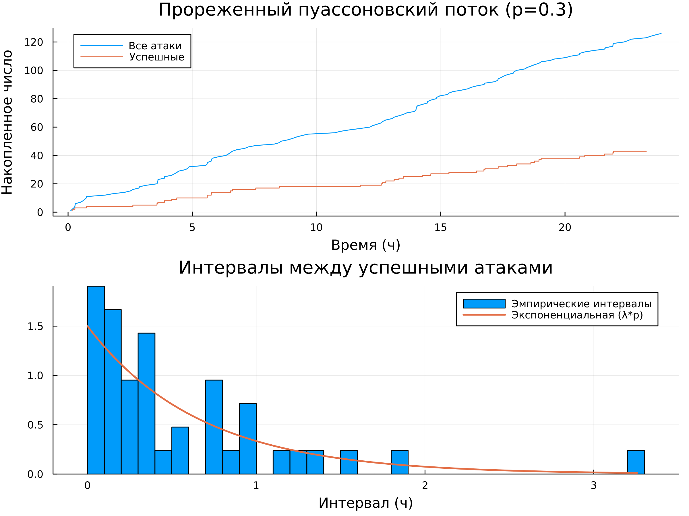{#fig-026 width=50%}

## Задание №6

{#fig-027 width=40%}

## Задание №6

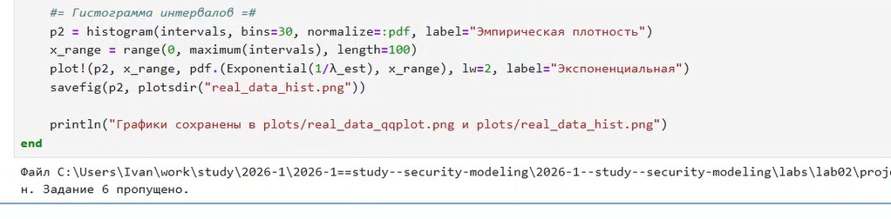{#fig-028 width=70%}

# Генерация из литературного кода

## Написание скрипта

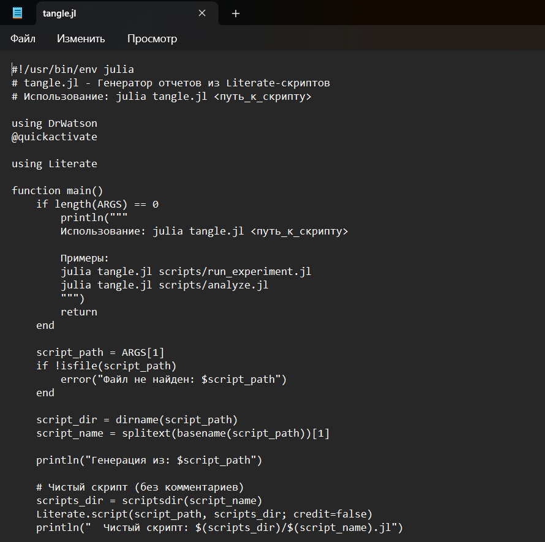{#fig-029 width=40%}

## Выполнение скрипта

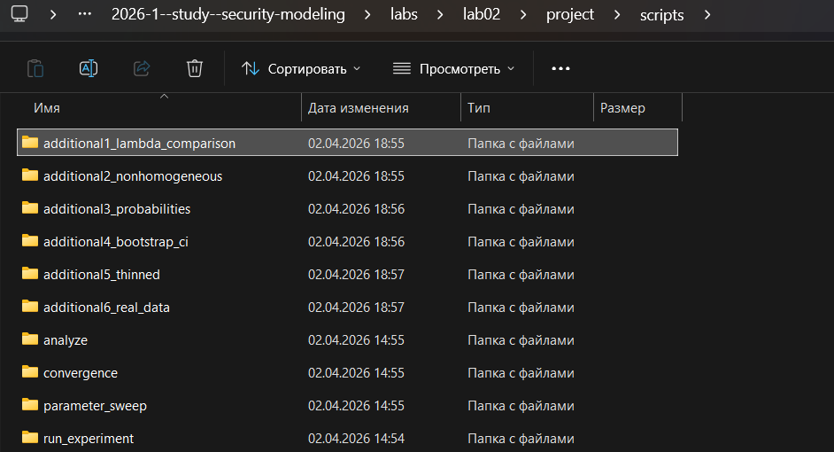{#fig-030 width=70%}

## Выполнение скрипта

{#fig-031 width=70%}

## Выполнение скрипта

{#fig-032 width=70%}

## Проверка

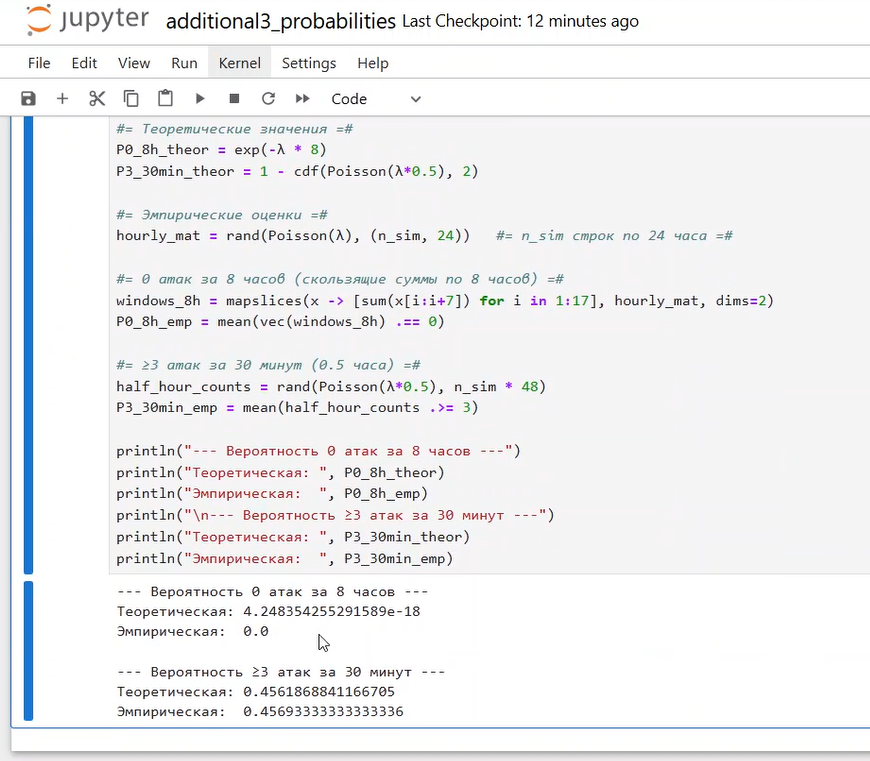{#fig-033 width=40%}

## Интеграция документации

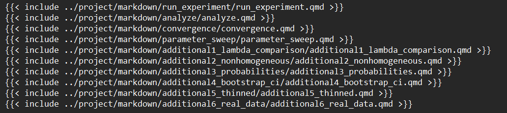{#fig-034 width=70%}

# Выводы

В ходе лабораторной работы реализована симуляция пуассоновского потока атак на веб‑сервер, выполнена генерация случайных величин с заданными распределениями, проведён статистический анализ и визуализация результатов. Проверка соответствия эмпирических распределений теоретическим (Пуассон и экспонента) подтвердила адекватность модели. Исследована сходимость оценки вероятности редкого события, выполнено параметрическое сканирование по интенсивности $\lambda$, а также реализованы дополнительные задания (нестационарный поток, бутстреп, прореживание). Все поставленные задачи решены, модель может быть использована для анализа киберугроз.

# Список литературы

1. JuliaLang [Электронный ресурс]. 2026 JuliaLang.org contributors. URL: https: //julialang.org/ (дата обращения: 02.04.2026).
2. Julia 1.12 Documentation [Электронный ресурс]. 2026 JuliaLang.org contributors. URL: https://docs.julialang.org/en/v1/ (дата обращения: 02.04.2026).