---
## Author
author:
  name: Махорин Иван Сергеевич
  degrees: BSc
  orcid: 0000-0002-0877-7063
  email: 1032259380@rudn.ru
  affiliation:
    - name: Российский университет дружбы народов
      country: Российская Федерация
      postal-code: 117198
      city: Москва
      address: ул. Миклухо-Маклая, д. 6

## Title
title: "Отчёт по лабораторной работе №2"
subtitle: "Основы вероятностного моделирования угроз"
license: "CC BY"
bibliography: bib/cite.bib
nocite: |
  @*
---

# Цель работы

Освоить базовые методы вероятностного моделирования случайных процессов в контексте кибербезопасности на примере моделирования потока атак на веб-сервер, включая генерацию случайных величин с заданным распределением, статистический анализ смоделированных данных, проверку соответствия эмпирического распределения теоретическому, оценку вероятностей редких событий, определение набора параметров модели (интенсивность атак, длительность наблюдения и т.д.), реализацию симуляции пуассоновского потока атак, выполнение статистического анализа результатов, визуализацию данных и проверку соответствия теоретическим распределениям.

# Задание

### Задачи лабораторной работы

1. Создать проект DrWatson с именем project.
2. Определить набор параметров модели (словарь params) с возможностью варьирования.
3. Написать функцию simulate_attacks(params), которая возвращает структуру с результатами симуляции (например, массив числа атак по часам, интервалы, моменты времени).
4. Использовать produce_or_load для запуска симуляции с заданными параметрами и сохранения результатов на диск.
5. Провести серию экспериментов с разными значениями параметров (например, разные $\lambda$, разная длительность).
6. Загрузить сохранённые результаты и выполнить:
    - построение гистограммы числа атак за час и сравнение с теоретическим распределением Пуассона;
    - построение графика накопленного числа атак и интервалов между атаками;
    - проверку экспоненциальности интервалов (гистограмма, QQ-plot, возможно критерий согласия);
    - оценку вероятности события «более 10 атак за час» теоретически и эмпирически.
7. Проанализировать зависимость точности оценки вероятности от числа симуляций.

# Теоретическое введение

## Теоретические сведения

Во многих задачах кибербезопасности поток атак (или инцидентов) можно приближённо считать простейшим, или пуассоновским, потоком. Такой поток обладает тремя основными свойствами: стационарностью (вероятность появления $k$ событий за интервал времени длины $t$ зависит только от $t$ и не зависит от момента начала отсчёта), отсутствием последействия (число событий в непересекающихся интервалах независимы) и ординарностью (вероятность появления двух и более событий за бесконечно малый интервал времени пренебрежимо мала). Для пуассоновского потока число событий $N_t$ за время $t$ распределено по закону Пуассона:

$$
P(N_t = k) = \frac{(\lambda t)^k}{k!} e^{-\lambda t}, \quad k = 0, 1, 2, \dots,
$$

где $\lambda$ — интенсивность потока, то есть среднее число событий в единицу времени.

В простейшем потоке интервалы времени между соседними событиями $\tau_1, \tau_2, \dots$ независимы и имеют экспоненциальное распределение с параметром $\lambda$:

$$
f(\tau) = \lambda e^{-\lambda \tau}, \quad \tau \ge 0,
$$

причём среднее значение интервала равно $\mathbb{E}[\tau] = 1/\lambda$.

Применительно к моделированию киберугроз пусть $\lambda$ — среднее количество успешных атак на веб‑сервер за час. Тогда количество атак за сутки (24 часа) является случайной величиной, распределённой по Пуассону с параметром $24\lambda$, а время между соседними атаками — экспоненциальной величиной. В рамках лабораторной работы необходимо научиться оценивать вероятности различных событий, например, вероятность того, что за час произойдёт более 10 атак:

$$
P(\text{более 10 атак за час}) = 1 - \sum_{k=0}^{10} \frac{\lambda^k}{k!} e^{-\lambda}.
$$

# Выполнение лабораторной работы

Для начала создадим проект DrWatson с именем project в папке lab02 ([рис. @fig-001]):

{#fig-001 width=70%}

После этого установим все необходимые пакеты и выполним проверку, для этого будем использовать написанные скрипты, как в lab01, но с добавлением новых пакетов ([рис. @fig-002]): 

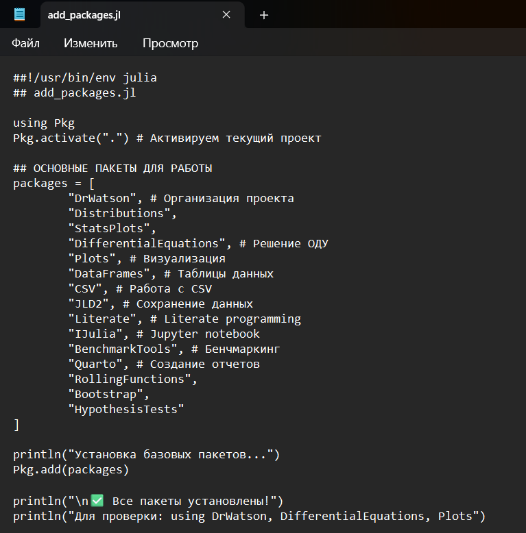{#fig-002 width=70%}

Теперь приступим к выполнению практических заданий из лабораторной работы.

В первую очередь определим набор параметров модели (словарь params) с возможностью варьирования. Словарь params вынесем в отдельный скрипт, чтобы в дальнейшем можно было его использовать и не повторять в отдельных файлах этот набор параметров, а просто подключать данный файл ([рис. @fig-003]):

{#fig-003 width=70%}

Напишем функцию симуляции ([рис. @fig-004]):

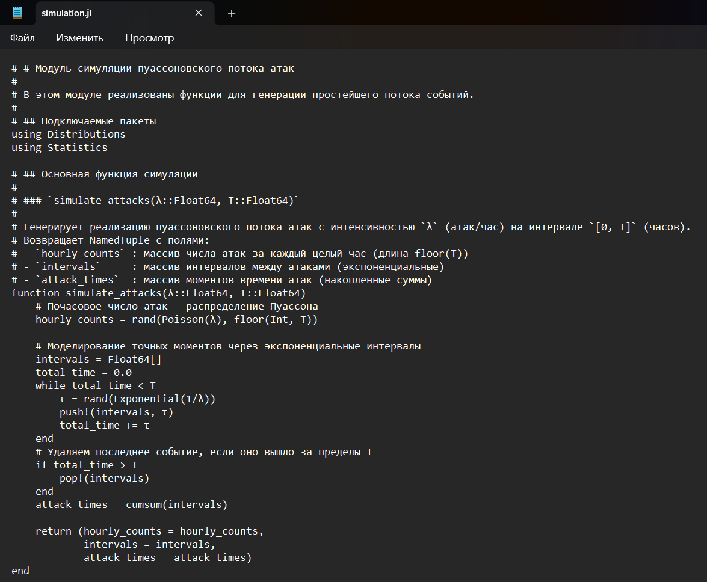{#fig-004 width=70%}

Далее напишем скрипт для запуска эксперимента с сохранением результатов ([рис. @fig-005]):

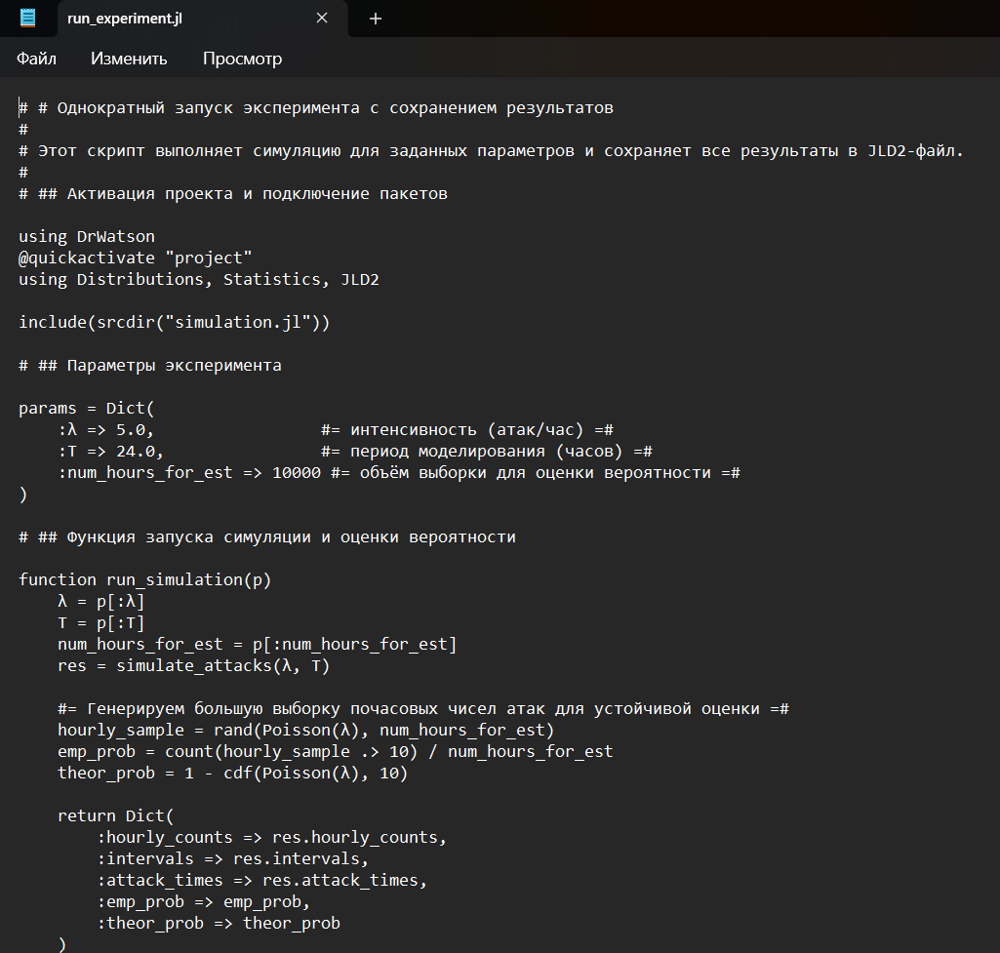{#fig-005 width=70%}

А также скрипт для анализа и визуализации результатов ([рис. @fig-006]):

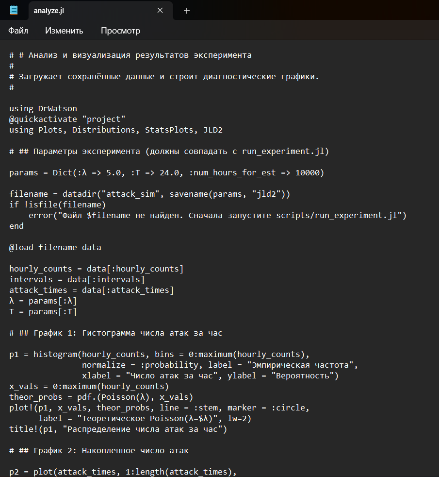{#fig-006 width=70%}

Выполним скрипты и просмотрим визуализацию результатов одного эксперимента ([рис. @fig-007]):

{#fig-007 width=70%}

Следующим шагом добавим скрипт для исследования сходимости оценки вероятности ([рис. @fig-008]):

{#fig-008 width=70%}

Выполним скрипт и просмотрим график сходимости оценки вероятности ([рис. @fig-009]):

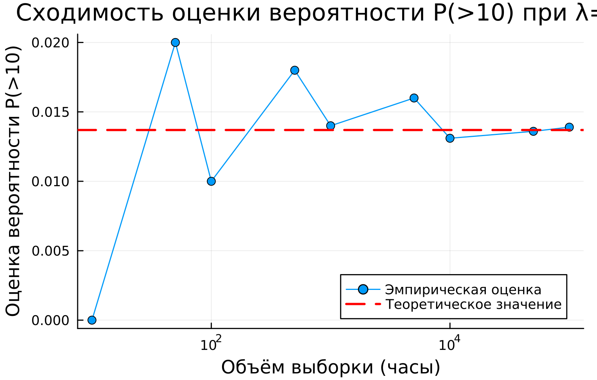{#fig-009 width=70%}

Завершим первую часть лабораторной работы скриптом для многовариантного эксперимента ([рис. @fig-010]):

{#fig-010 width=70%}

Выполним скрипт и просмотрим графики ([рис. @fig-011] - [рис. @fig-016]):

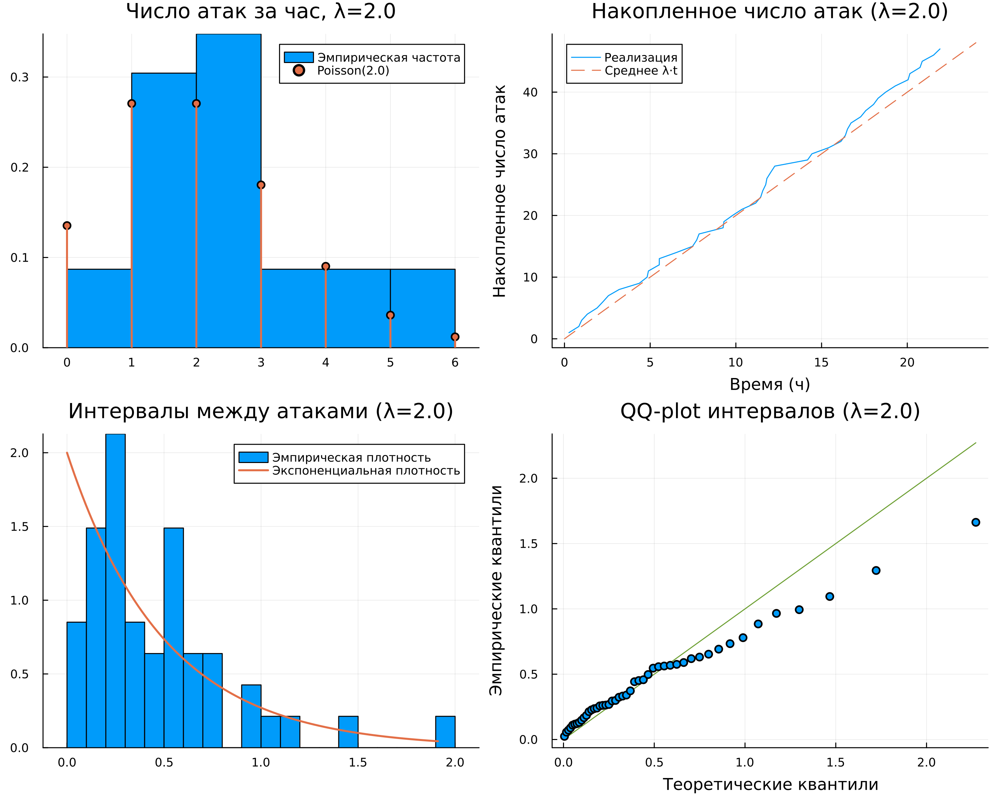{#fig-011 width=70%}

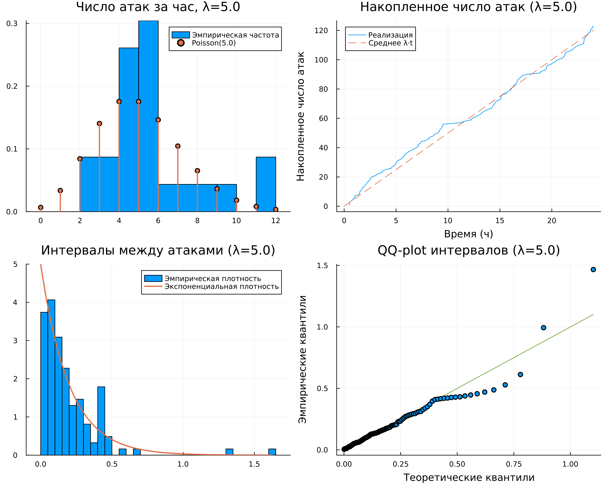{#fig-012 width=70%}

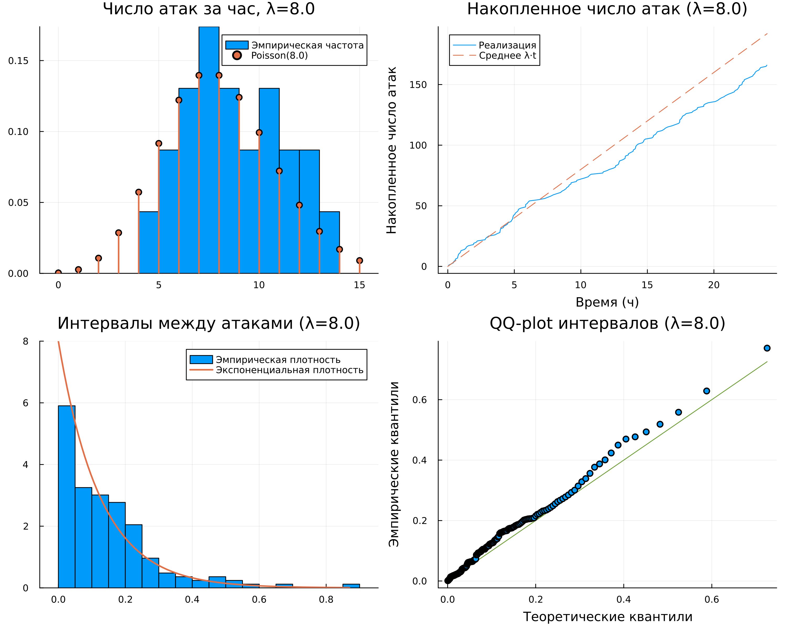{#fig-013 width=70%}

{#fig-014 width=70%}

{#fig-015 width=70%}

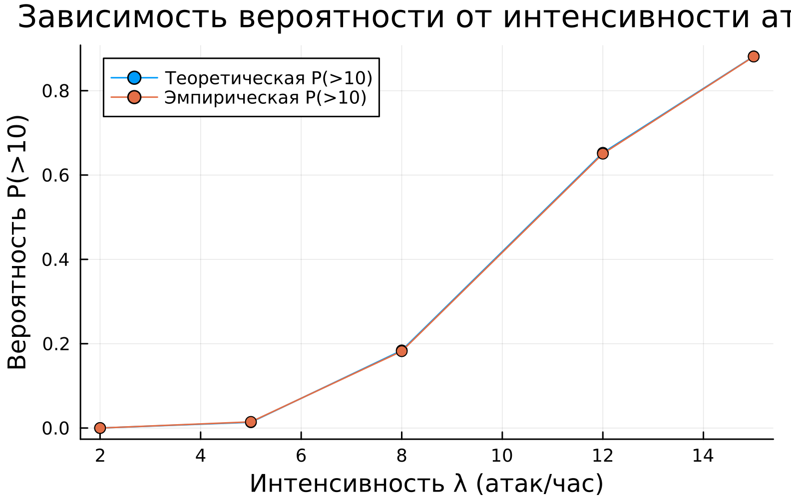{#fig-016 width=70%}

# Ответы на контрольные вопросы

1. Какими свойствами обладает простейший поток событий? Почему он часто используется для моделирования атак?
	- Свойства: стационарность, отсутствие последействия, ординарность. Используется из-за простоты и адекватности реальным потокам атак.
2. Как сгенерировать реализацию пуассоновского потока на интервале времени?
	- Генерация: моделируем экспоненциальные интервалы с параметром λ или генерируем почасовые пуассоновские величины.
3. Как проверить, что интервалы между событиями распределены экспоненциально?
	- Проверка: гистограмма интервалов с наложением теоретической плотности; QQ-plot; критерий Колмогорова-Смирнова.
4. В чём преимущества использования DrWatson для организации вычислительного эксперимента?
	- Преимущества DrWatson: стандартная структура, автоматическое кэширование, генерация имён файлов по параметрам, интеграция с Git, воспроизводимость.
5. Что такое produce_or_load и как он работает?
	- produce_or_load: функция, которая по параметрам проверяет наличие файла; если есть – загружает, иначе вычисляет результат и сохраняет.
6. Какая структура проекта создаётся DrWatson? Для чего нужны папки data, plots, scripts, src?
	- Структура: data/ – результаты, plots/ – графики, scripts/ – скрипты, src/ – библиотеки. Разделение ответственности.
7. Как задать набор параметров для множественных запусков в DrWatson?
	- Задание параметров: через Dict с векторами значений и dict_list или массивом словарей; имена файлов генерируются автоматически.

# Дополнительные задания

1.  Изменить интенсивность $\lambda$ (например, 2, 8, 12 атак/час) и сравнить результаты.
2.  Моделировать нестационарный пуассоновский поток с интенсивностью, зависящей от времени суток: $\lambda(t) = 2 + 5 \sin(\pi t / 12)$. Модифицировать функцию симуляции (использовать метод прореживания или неоднородный пуассоновский процесс).
3.  Исследовать вероятность события «ни одной атаки за смену (8 часов)» или «не менее 3 атак за 30 минут».
4.  Оценить доверительный интервал для вероятности редкого события методом бутстрепа.
5.  Добавить в модель возможность успешности атаки: каждая атака имеет вероятность успеха $p$, тогда успешные атаки образуют прореженный пуассоновский поток. Модифицировать симуляцию и проанализировать.
6.  Использовать реальные данные об атаках (если предоставлены) и проверить гипотезу о пуассоновости.

Скрипт для задания №1 ([рис. @fig-017]):

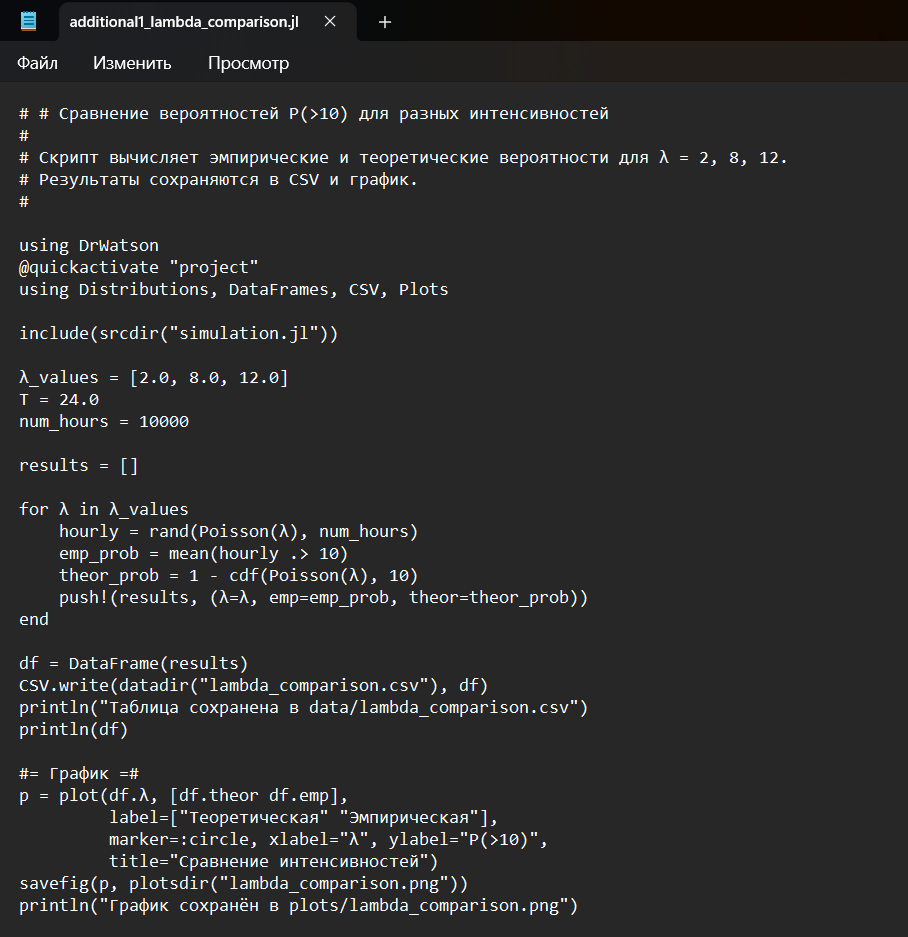{#fig-017 width=70%}

Результат выполнения скрипта для задания №1 ([рис. @fig-018]):

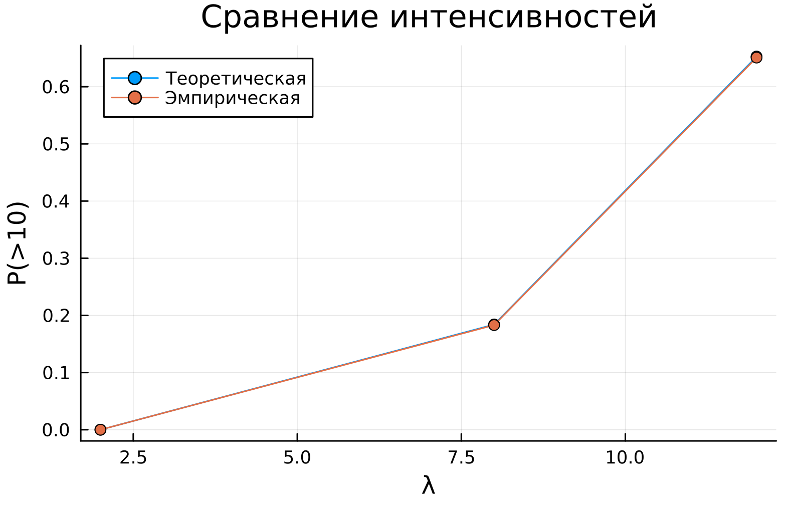{#fig-018 width=70%}

Скрипт для задания №2 ([рис. @fig-019]):

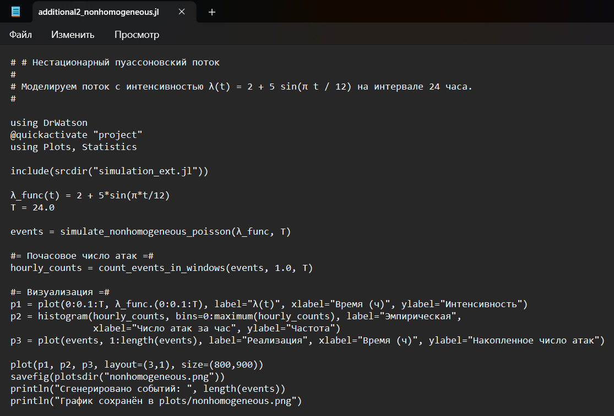{#fig-019 width=70%}

Результат выполнения скрипта для задания №2 ([рис. @fig-020]):

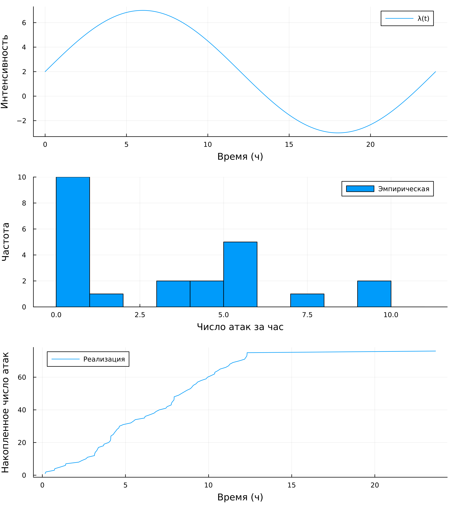{#fig-020 width=70%}

Скрипт для задания №3 ([рис. @fig-021]):

{#fig-021 width=70%}

Результат выполнения скрипта для задания №3 ([рис. @fig-022]):

{#fig-022 width=70%}

Скрипт для задания №4 ([рис. @fig-023]):

{#fig-023 width=70%}

Результат выполнения скрипта для задания №4 ([рис. @fig-024]):

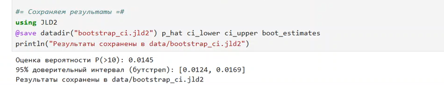{#fig-024 width=70%}

Скрипт для задания №5 ([рис. @fig-025]):

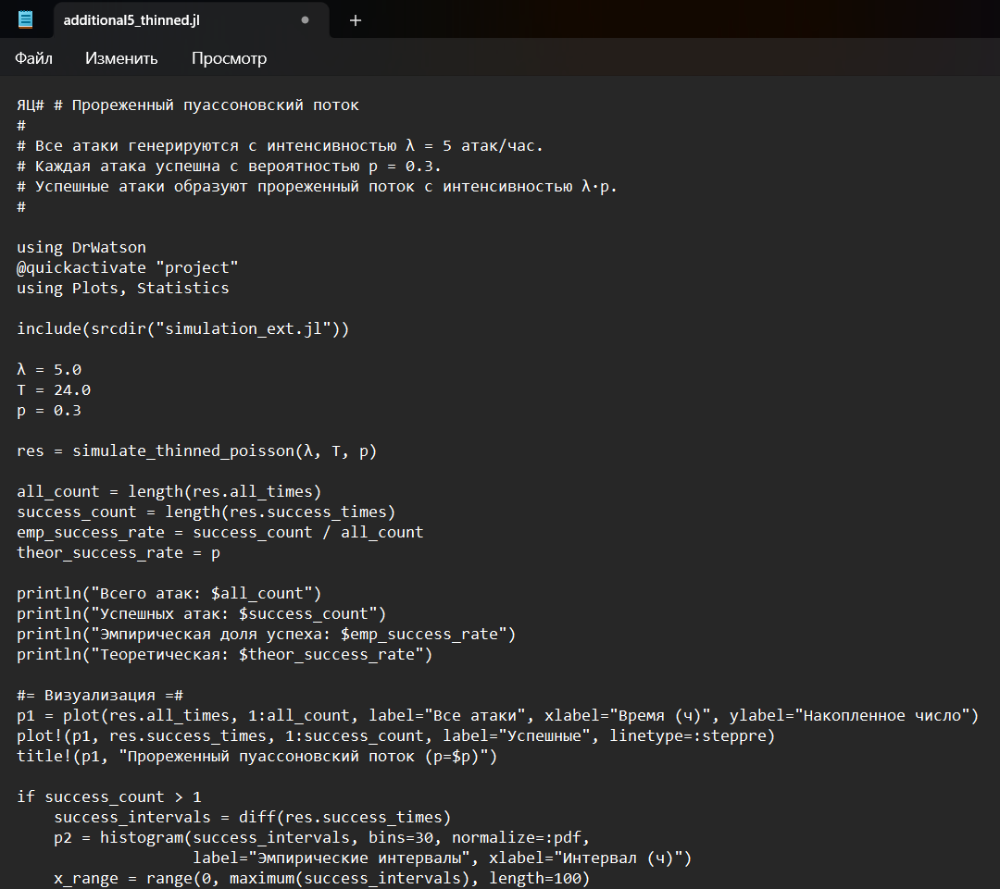{#fig-025 width=70%}

Результат выполнения скрипта для задания №5 ([рис. @fig-026]):

{#fig-026 width=70%}

Скрипт для задания №6 ([рис. @fig-027]):

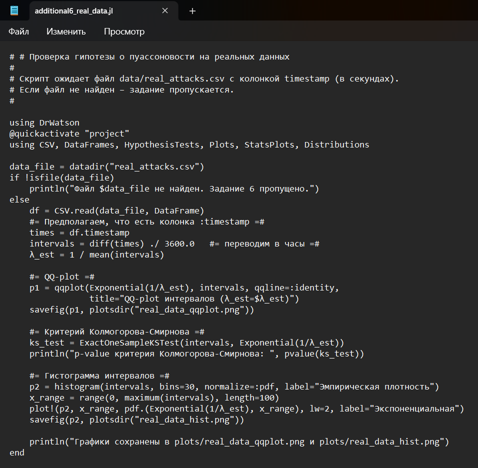{#fig-027 width=70%}

Результат выполнения скрипта для задания №6 ([рис. @fig-028]):

{#fig-028 width=70%}

# Генерация из литературного кода

Выполним генерацию по всем скриптам из литературного кода в чистый код, jupyter notebook, а также в документацию в формате Quarto. Для удобства возьмём скрипт из первой лабораторной работы ([рис. @fig-029]):

{#fig-029 width=70%}

Запустим скрипт и проверим результат ([рис. @fig-030] - [рис. @fig-032]):

{#fig-030 width=70%}

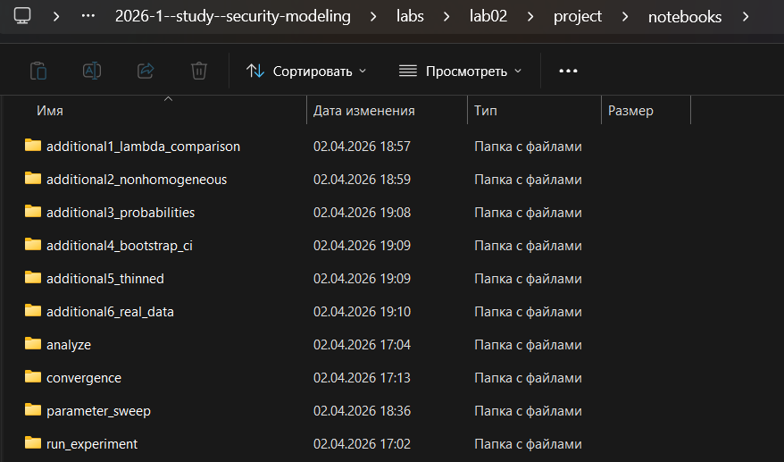{#fig-031 width=70%}

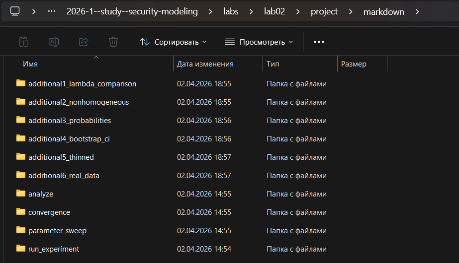{#fig-032 width=70%}

Затем выполним код для всех файлов из jupyter notebook для контрольной проверки ([рис. @fig-033]):

{#fig-033 width=70%}

В конце интегрируем документацию в формате Quarto в отчёт ([рис. @fig-034]):

{#fig-034 width=70%}












# Выводы

## Выводы

В ходе лабораторной работы реализована симуляция пуассоновского потока атак на веб‑сервер, выполнена генерация случайных величин с заданными распределениями, проведён статистический анализ и визуализация результатов. Проверка соответствия эмпирических распределений теоретическим (Пуассон и экспонента) подтвердила адекватность модели. Исследована сходимость оценки вероятности редкого события, выполнено параметрическое сканирование по интенсивности $\lambda$, а также реализованы дополнительные задания (нестационарный поток, бутстреп, прореживание). Все поставленные задачи решены, модель может быть использована для анализа киберугроз.

# Список литературы{.unnumbered}

::: {#refs}
:::
