---
# Preamble

## Author
author:
  name: Махорин Иван Сергеевич
  degrees: BSc
  orcid: 0009-0005-2255-4025
  email: 1032259380@rudn.ru
  affiliation:
    - name: Российский университет дружбы народов
      country: Российская Федерация
      postal-code: 117198
      city: Москва
      address: ул. Миклухо-Маклая, д. 6
## Title
title: "Лабораторная работа №3"
subtitle: "Моделирование графов атак"
license: "CC BY"
date: 2026-05-01
## Generic options
lang: ru-RU
crossref:
  lof-title: Список иллюстраций
  lot-title: Список таблиц
  lol-title: Листинги
## Formats
format:
### Pdf output format
  beamer:
    toc: false
    toc-title: Содержание
    number-sections: true
    colorlinks: false
    toc-depth: 2
    slide_level: 2
    aspectratio: 169
    section-titles: true
    theme: metropolis
    themeoptions: progressbar=frametitle,sectionpage=progressbar,numbering=fraction
#### Language
    babel-lang: russian
    babel-otherlangs: english
### Html output
  revealjs:
    transition: slide
    margin: 0.2
    smaller: false
    output-ext: html
    theme: beige
    logo: _resources/image/logo_rudn.png
---

# Информация

## Докладчик

:::::::::::::: {.columns align=center}
::: {.column width="70%"}

  * Махорин Иван Сергеевич
  * студент группы НФИмд-02-25
  * Российский университет дружбы народов им. П. Лумумбы
  * [1032259380@rudn.ru](mailto:1032259380@rudn.ru)
  * <https://github.com/Ivan-Makhorin>

:::
::: {.column width="30%"}

:::
::::::::::::::

# Введение

## Цель работы

Целью лабораторной работы является освоение методов построения и анализа графов атак для оценки уязвимостей сетевой инфраструктуры на примере моделирования атак на корпоративную сеть, включая представление сетевой топологии и уязвимостей в виде ориентированного графа, алгоритмы поиска всех возможных путей атаки от начальных точек до целевых активов, расчёт метрик центральности для определения критических узлов, визуализацию графа с цветовой индикацией уровня риска и оценку вероятности успешной атаки с учётом сложности эксплуатации уязвимостей.

## Задачи лабораторной работы

1. Построить граф атак для заданной топологии сети.
2. Реализовать алгоритм поиска всех путей от заданного источника к цели.
3. Рассчитать метрики центральности для всех узлов и выявить наиболее критичные.
4. Визуализировать граф, раскрашивая узлы в зависимости от степени риска.
5. Присвоить каждому ребру вес (вероятность успешной атаки) и вычислить наиболее вероятный путь атаки.

# Ход выполнения лабораторной работы

## Проект DrWatson

{#fig-001 width=70%}

## Установка пакетов

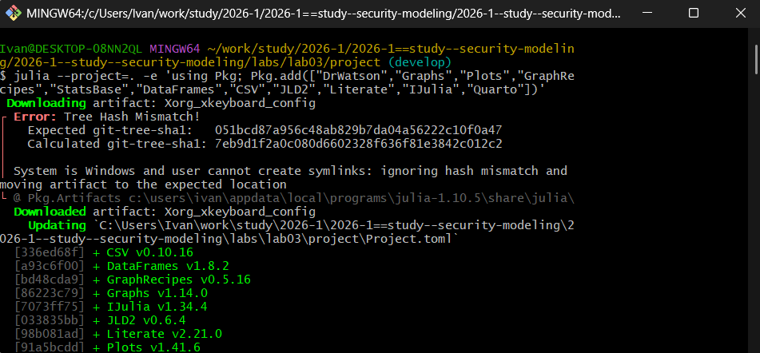{#fig-002 width=60%}

## Написание скрипта

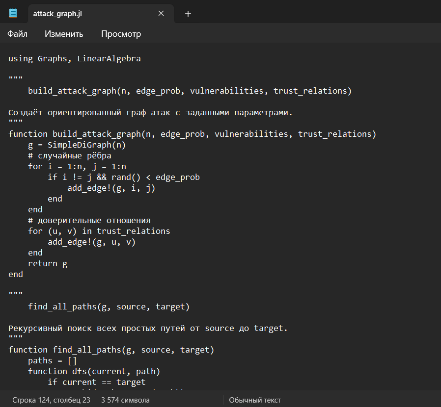{#fig-003 width=40%}

## Написание скрипта

{#fig-004 width=40%}

## Написание скрипта

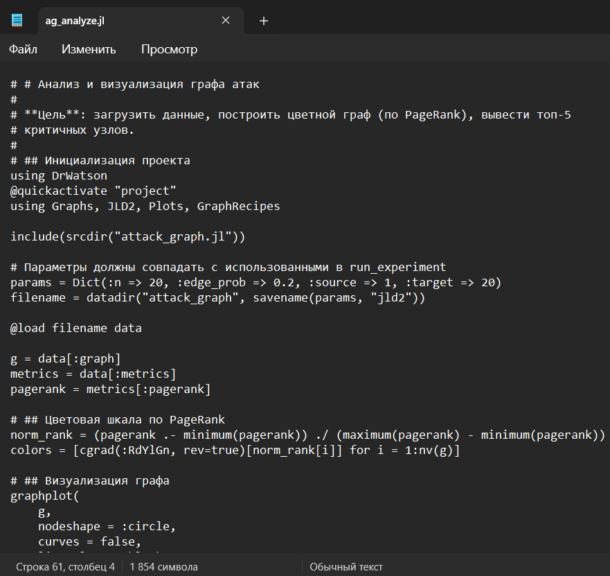{#fig-005 width=40%}

## Написание скрипта

{#fig-006 width=40%}

## Написание скрипта

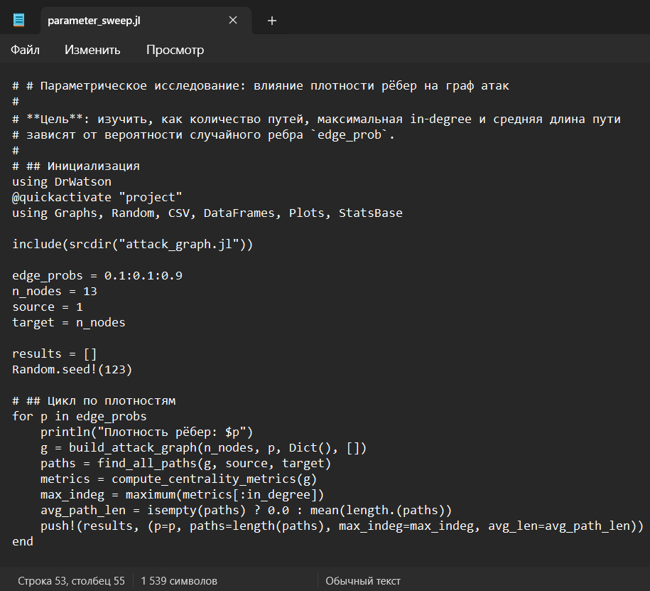{#fig-007 width=40%}

## Выполнение скрипта

{#fig-008 width=50%}

## Выполнение скрипта

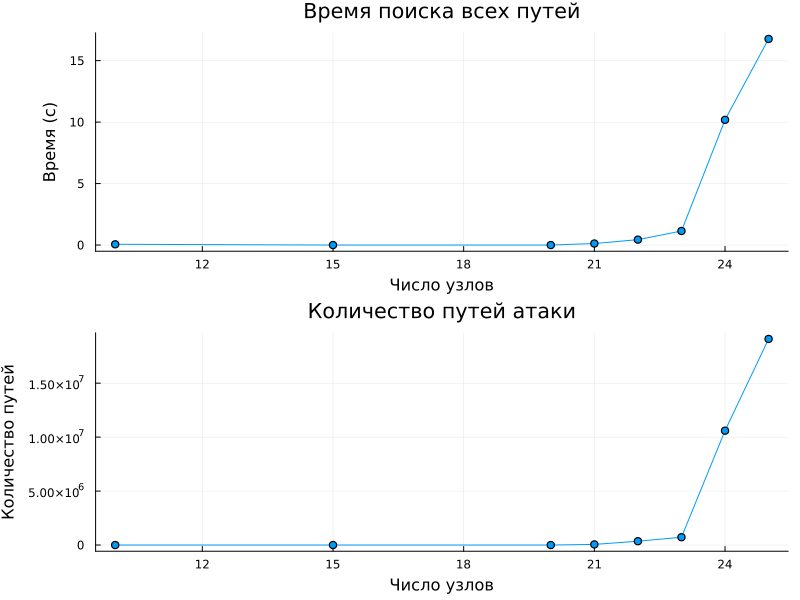{#fig-009 width=40%}

## Выполнение скрипта

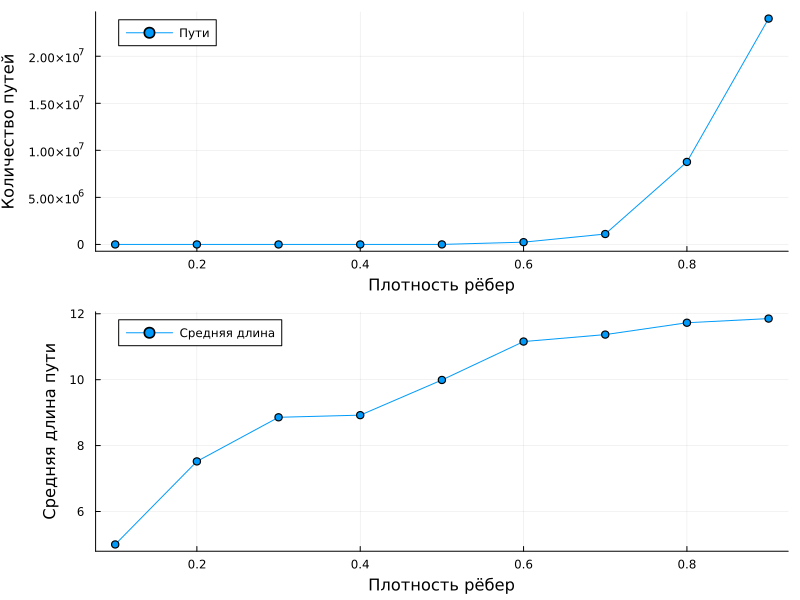{#fig-010 width=40%}

# Ответы на контрольные вопросы

## Ответы на контрольные вопросы

**1. Что такое граф атак и для чего он используется?**  
Граф атак — ориентированный граф, моделирующий возможные шаги злоумышленника между узлами сети. Применяется для выявления всех путей проникновения к критическим активам и оценки уязвимости инфраструктуры.

**2. Какие алгоритмы поиска путей применяются в анализе графов атак?**  
Используются поиск в глубину (DFS) для перечисления всех путей, поиск в ширину (BFS) для кратчайшего по числу шагов, и алгоритм Дейкстры с весами $-\ln p_{uv}$ для нахождения наиболее вероятного пути.

**3. Что означают метрики центральности (in-degree, PageRank) в контексте безопасности?**  
In-degree показывает количество атак, непосредственно направленных на узел, — чем он выше, тем уязвимее цель. PageRank учитывает не только число входящих связей, но и важность соединяющихся узлов; высокий PageRank означает, что узел критичен и его компрометация может привести к каскадному распространению атаки.

## Ответы на контрольные вопросы

**4. Как можно оценить вероятность успешной атаки с помощью весов рёбер?**  
Каждому ребру $(u,v)$ ставится в соответствие вероятность $p_{uv}$ успешной эксплуатации. Вероятность пути равна $\prod p_{uv}$; общая вероятность достижения цели — максимум таких произведений по всем путям. Для поиска максимума используется Дейкстра с весами $-\ln p_{uv}$, так как $\max\prod p \Leftrightarrow \min\sum(-\ln p)$.

**5. Какие ограничения имеет модель графа атак в реальных условиях?**  
Модель статична, вероятности эксплуатации часто неизвестны, число путей экспоненциально растёт с размером сети, не учитываются защитные средства (межсетевые экраны, IDS) и сложные зависимости между уязвимостями.

**6. Как можно расширить модель для учёта защитных механизмов (например, межсетевые экраны)?**  
Ввести на рёбра фильтры или понижающие коэффициенты, имитирующие действие межсетевого экрана, либо добавить специальные вершины-«файрволы» с правилами прохождения, либо использовать многослойный граф с разделением узлов по уровням защищённости.

# Дополнительные задания

## Дополнительные задания

1. Добавить в граф атак веса уязвимостей (CVSS) и найти наиболее вероятный путь с помощью алгоритма Дейкстры (с учётом логарифмов вероятностей).
2. Реализовать модель распространения атаки с использованием агентного подхода: каждый узел может быть скомпрометирован с вероятностью, зависящей от соседей.
3. Сравнить разные метрики центральности и определить, какие из них лучше предсказывают узлы, наиболее уязвимые для атак.
4. Использовать реальные данные о топологии сети (например, из датасетов сетей) для построения графа атак.
5. Визуализировать граф с помощью интерактивных библиотек (например, GraphPlot с возможностью наведения).
6. Оценить эффективность защитных мер (например, изоляция узла с высокой betweenness centrality) на снижение числа путей атаки.

## Задание №1

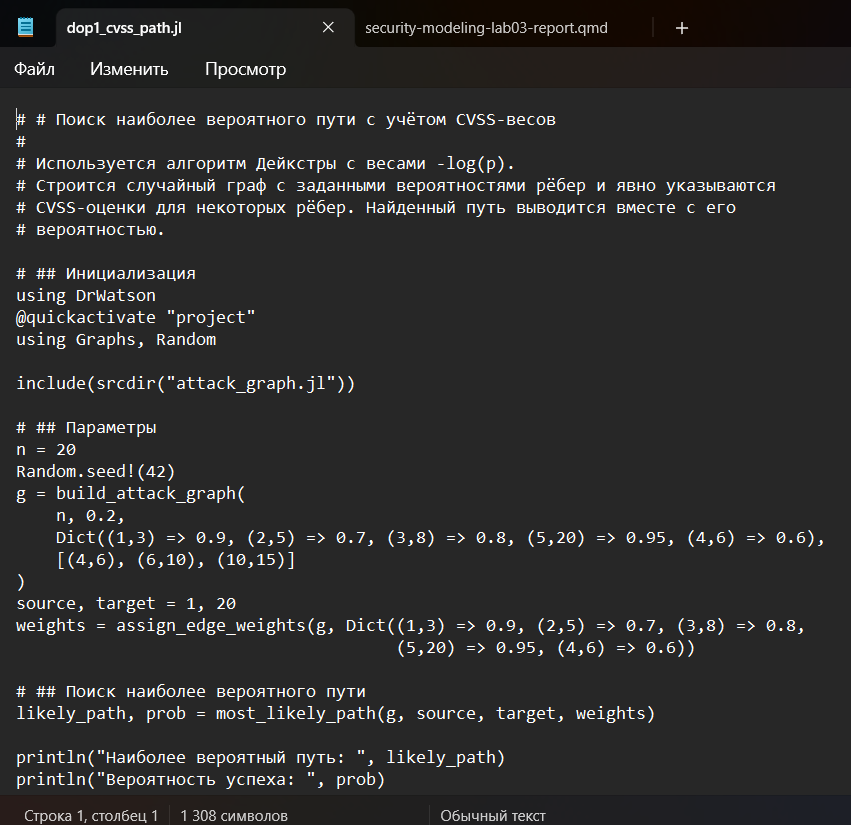{#fig-011 width=40%}

## Задание №1

{#fig-012 width=70%}

## Задание №2

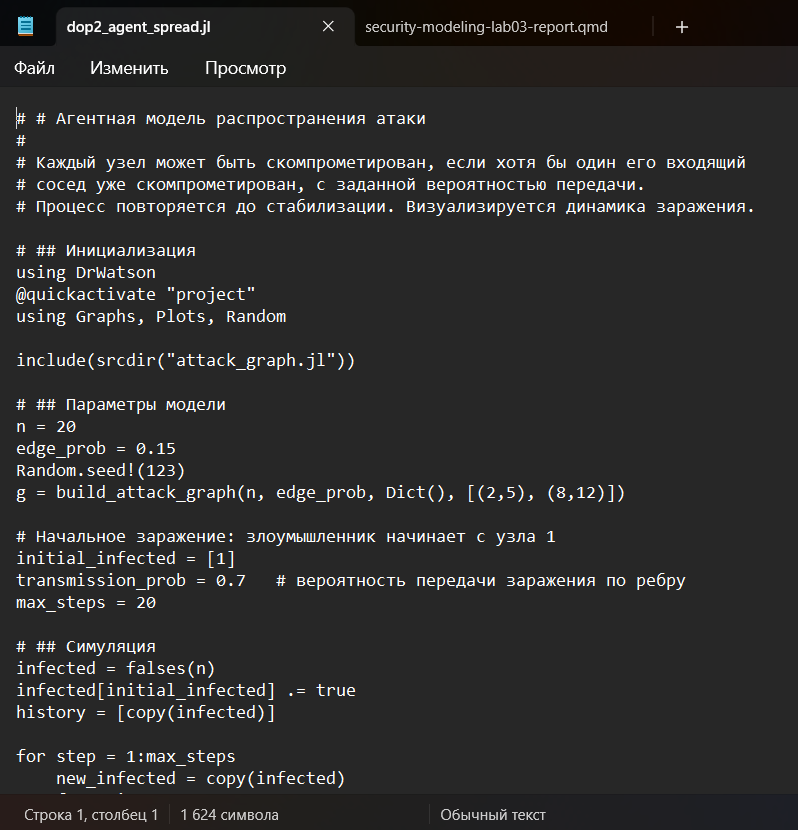{#fig-013 width=40%}

## Задание №2

{#fig-014 width=40%}

## Задание №3

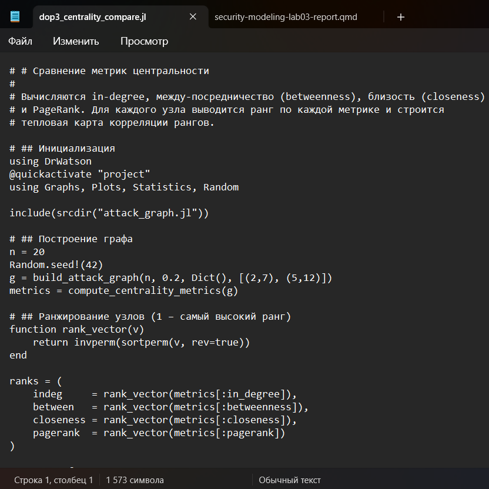{#fig-015 width=40%}

## Задание №3

{#fig-016 width=40%}

## Задание №4

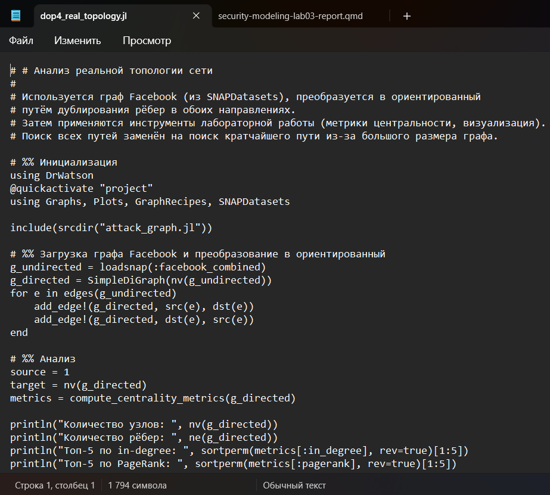{#fig-017 width=40%}

## Задание №4

{#fig-018 width=40%}

## Задание №5

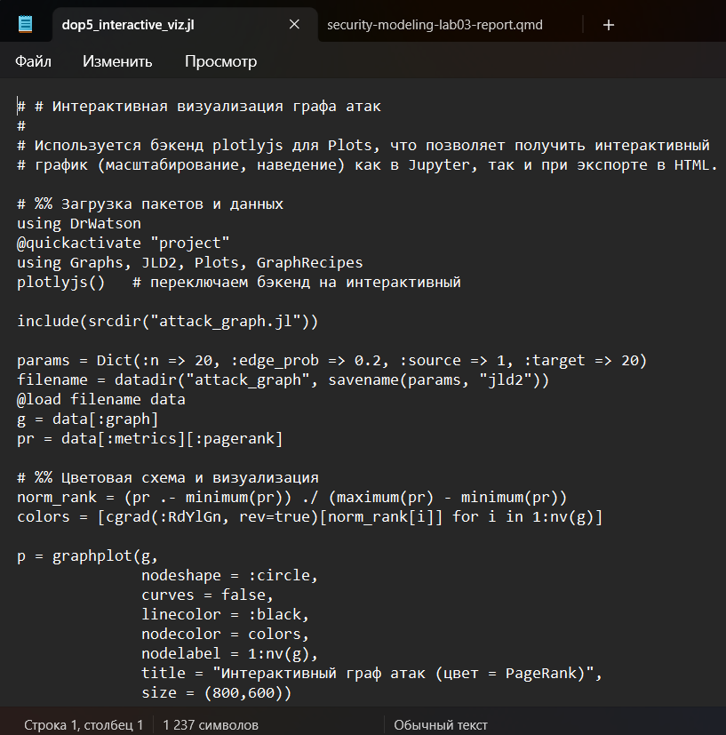{#fig-019 width=40%}

## Задание №5

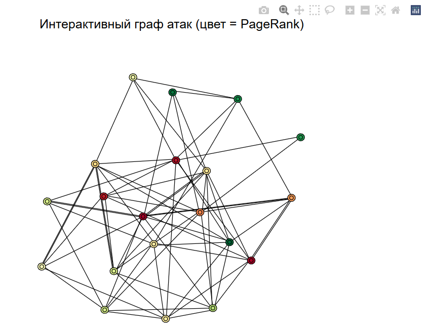{#fig-020 width=40%}

## Задание №6

{#fig-021 width=40%}

## Задание №6

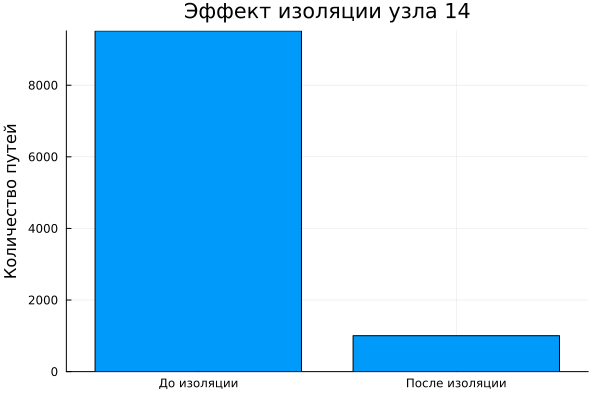{#fig-022 width=40%}

# Генерация из литературного кода

## Написание скрипта

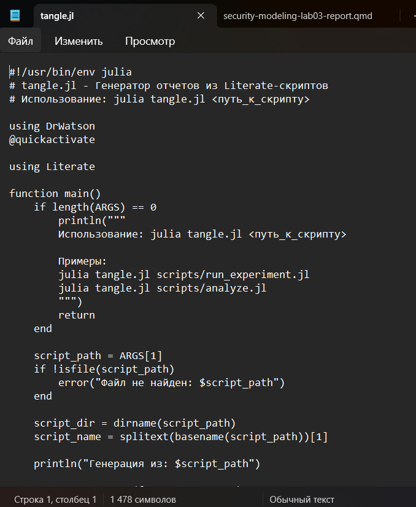{#fig-023 width=30%}

## Выполнение скрипта

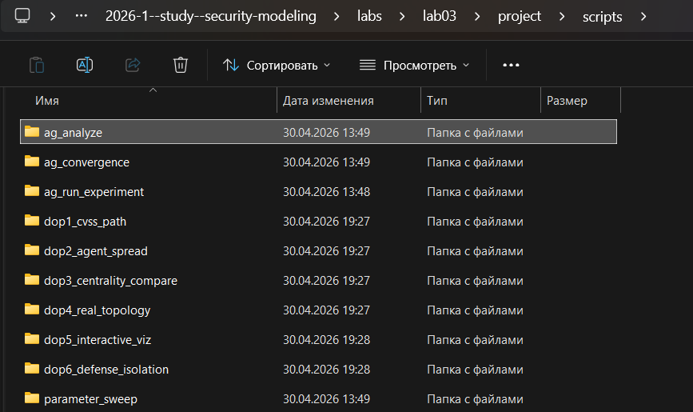{#fig-024 width=70%}

## Выполнение скрипта

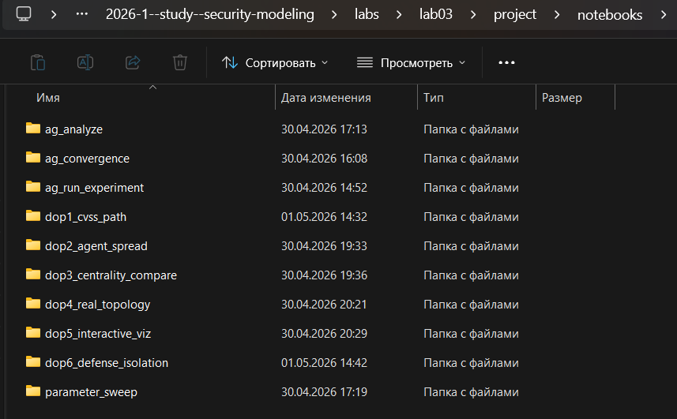{#fig-025 width=70%}

## Выполнение скрипта

{#fig-026 width=70%}

## Проверка

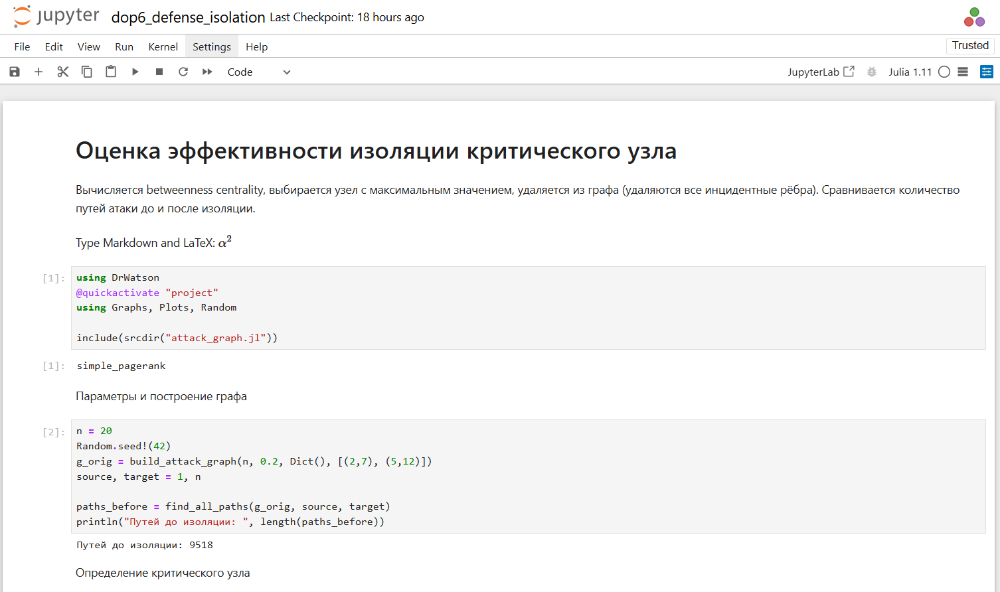{#fig-027 width=70%}

## Интеграция документации

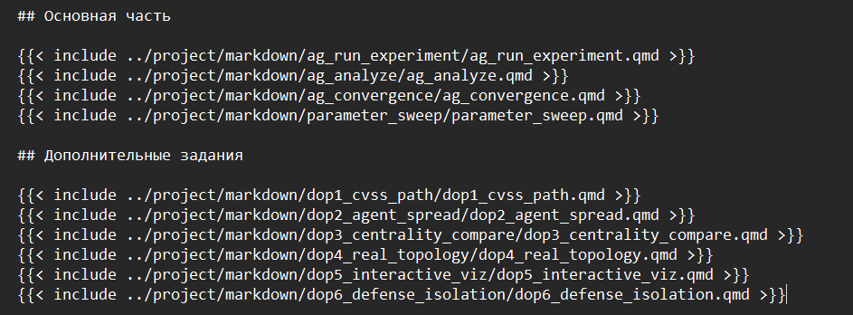{#fig-028 width=70%}

# Выводы

В ходе лабораторной работы построена модель графа атак, реализован поиск всех путей и наиболее вероятного пути с учётом весов уязвимостей, рассчитаны метрики центральности и выполнена визуализация. Исследование показало, что ключевые узлы, выделяемые по in-degree и PageRank, действительно являются критическими, а изоляция вершины с максимальной betweenness резко сокращает количество возможных атак. Модель подтвердила свою применимость для выявления слабых мест сети, но требует расширения для учёта динамики и защитных механизмов, т.к. рост числа путей с размером графа ограничивает её прямое использование на крупных инфраструктурах.

# Список литературы

1. JuliaLang [Электронный ресурс]. 2026 JuliaLang.org contributors. URL: https: //julialang.org/ (дата обращения: 02.04.2026).
2. Julia 1.12 Documentation [Электронный ресурс]. 2026 JuliaLang.org contributors. URL: https://docs.julialang.org/en/v1/ (дата обращения: 02.04.2026).