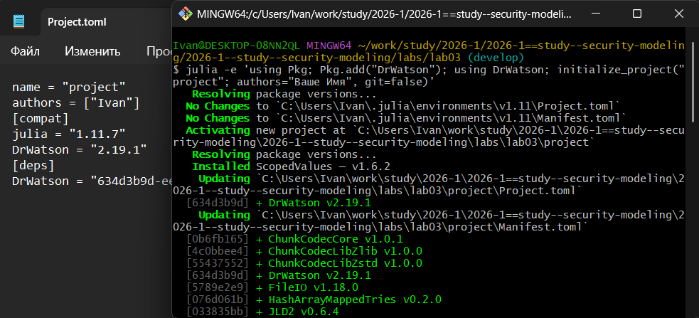
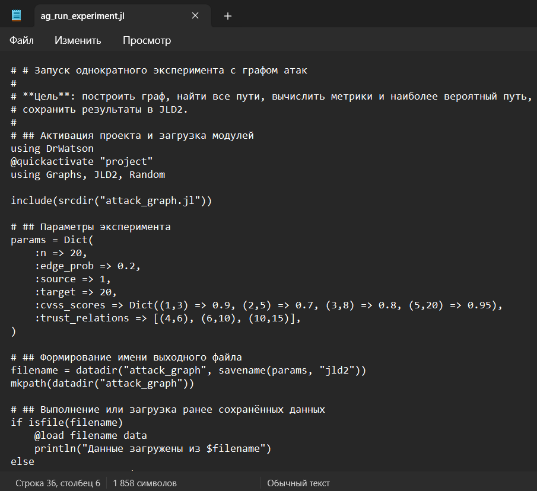
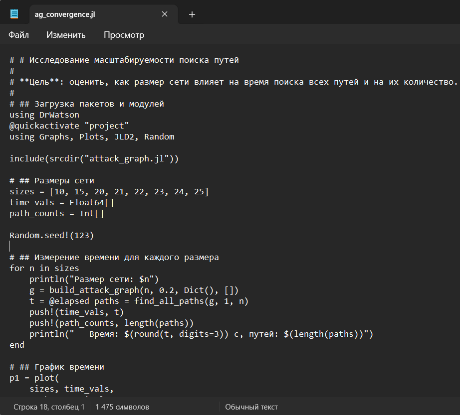
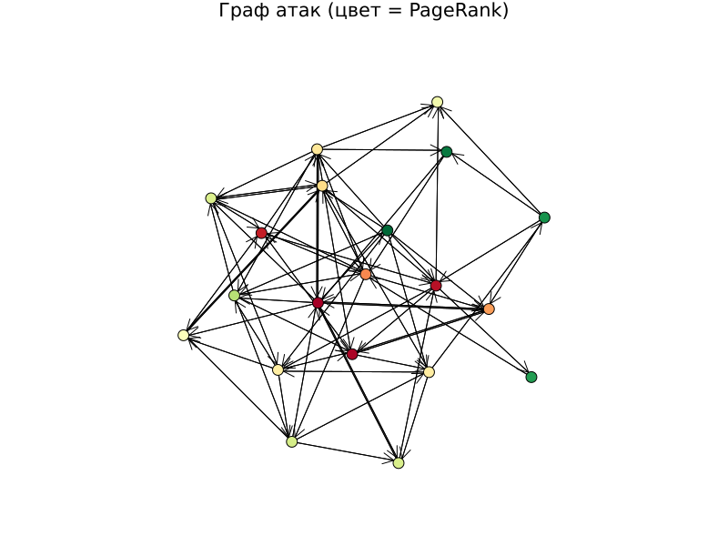
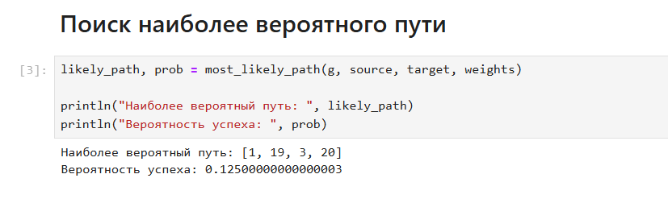
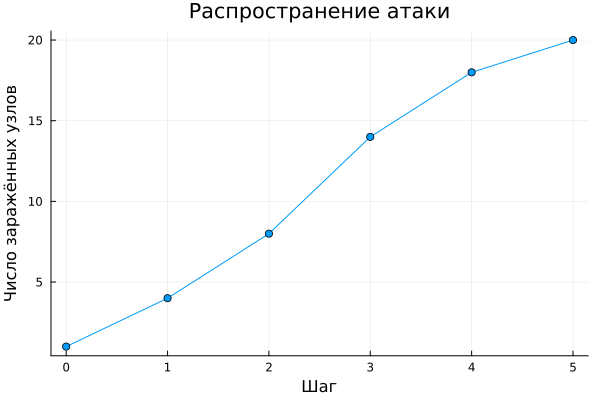
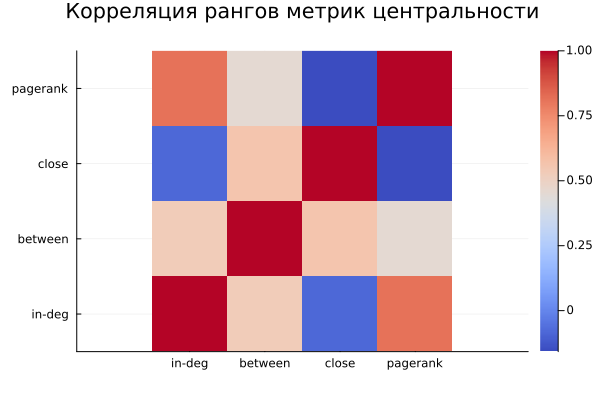
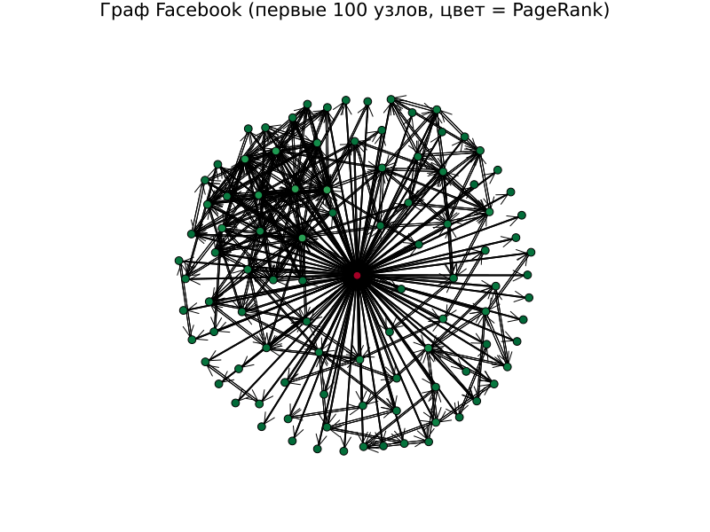
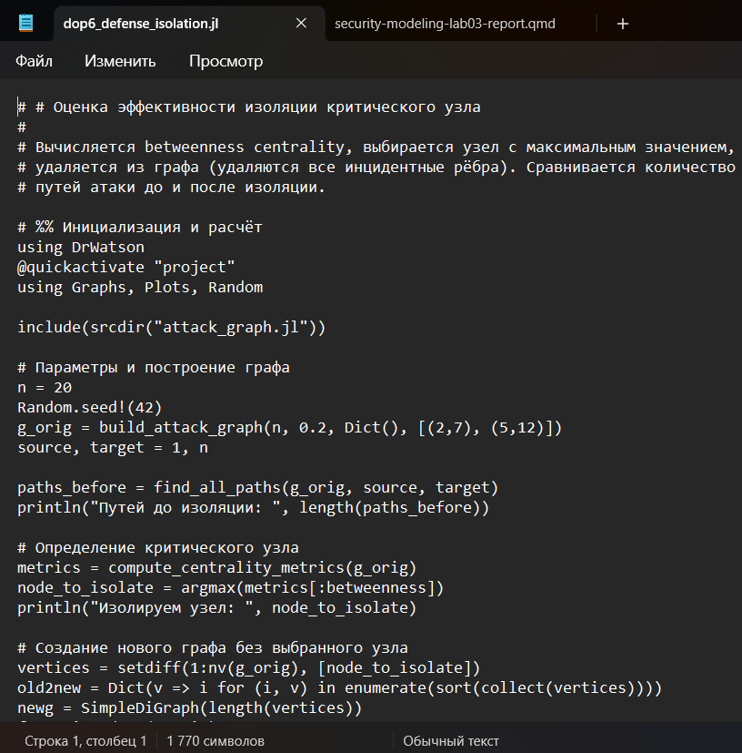

---
## Author
author:
  name: Махорин Иван Сергеевич
  degrees: BSc
  orcid: 0000-0002-0877-7063
  email: 1032259380@rudn.ru
  affiliation:
    - name: Российский университет дружбы народов
      country: Российская Федерация
      postal-code: 117198
      city: Москва
      address: ул. Миклухо-Маклая, д. 6

## Title
title: "Отчёт по лабораторной работе №3"
subtitle: "Моделирование графов атак"
license: "CC BY"
bibliography: bib/cite.bib
nocite: |
  @*
---

# Цель работы

Целью лабораторной работы является освоение методов построения и анализа графов атак для оценки уязвимостей сетевой инфраструктуры на примере моделирования атак на корпоративную сеть, включая представление сетевой топологии и уязвимостей в виде ориентированного графа, алгоритмы поиска всех возможных путей атаки от начальных точек до целевых активов, расчёт метрик центральности для определения критических узлов, визуализацию графа с цветовой индикацией уровня риска и оценку вероятности успешной атаки с учётом сложности эксплуатации уязвимостей.

# Задание

### Задачи лабораторной работы

1. Построить граф атак для заданной топологии сети.
2. Реализовать алгоритм поиска всех путей от заданного источника к цели.
3. Рассчитать метрики центральности для всех узлов и выявить наиболее критичные.
4. Визуализировать граф, раскрашивая узлы в зависимости от степени риска.
5. Присвоить каждому ребру вес (вероятность успешной атаки) и вычислить наиболее вероятный путь атаки.

# Теоретическое введение

## Теоретические сведения

Вот краткие теоретические сведения с правильно оформленными формулами для отчёта в формате Markdown:

## Теоретические сведения

**Граф атак** — ориентированный граф, где вершины — сетевые узлы, рёбра — возможные переходы злоумышленника (эксплуатация уязвимостей, доверительные отношения).

**Поиск путей атаки** — алгоритм DFS находит все простые пути от источника к цели. При наличии весов на рёбрах (вероятность успеха $p$) наиболее вероятный путь ищется алгоритмом Дейкстры с весами $-\ln p$, так как  

$$
\max \prod_{i} p_i \Leftrightarrow \min \sum_{i} (-\ln p_i).
$$

**Метрики центральности** — in-degree, betweenness, closeness и PageRank — позволяют выявить критические узлы: через них проходит наибольшее число атак или они наиболее доступны.

**Вероятность успеха** — для пути $v_1 \to v_2 \to \dots \to v_k$ вероятность равна  

$$
P = \prod_{i=1}^{k-1} p_{v_i v_{i+1}}.
$$

Общая вероятность атаки на цель — максимум по всем возможным путям.

# Выполнение лабораторной работы

Для начала создадим проект DrWatson с именем project в папке lab03 ([рис. @fig-001]):

{#fig-001 width=70%}

После этого установим все необходимые пакеты ([рис. @fig-002]): 

{#fig-002 width=70%}

Теперь приступим к выполнению практических заданий из лабораторной работы.

В первую очередь создадим файл со скриптом, который одержит все функции для построения ориентированного графа атак, поиска путей, расчёта метрик центральности, присвоения весов и нахождения наиболее вероятного пути. Это основной модуль, используемый всеми скриптами ([рис. @fig-003]):

{#fig-003 width=70%}

Напишем скрипт, выполняющий построение графа атак для заданных параметров, скрипт находит все пути, вычисляет метрики центральности, определяет наиболее вероятный путь и сохраняет результаты в JLD2-файл. Предназначен для генерации данных, которые будут анализироваться в других скриптах ([рис. @fig-004]):

{#fig-004 width=70%}

Далее создадим файл, который загружает сохранённые данные. Строит наглядное изображение графа (с цветовой индикацией по PageRank). Выводит статистику: количество узлов, рёбер, пути, топ-5 критичных узлов по in-degree и PageRank ([рис. @fig-005]):

{#fig-005 width=70%}

А также скрипт для исследования, как размер сети (число узлов) влияет на время поиска всех путей и на количество найденных путей. Позволяет оценить вычислительную сложность алгоритма ([рис. @fig-006]):

{#fig-006 width=70%}

Для завершения основной части лабораторной работы добавим скрипт для параметрического исследования. Скрипт будет изучать, как изменение плотности рёбер (вероятности случайного ребра) влияет на количество путей атаки, максимальную входящую степень и среднюю длину пути ([рис. @fig-007]):

{#fig-007 width=70%}

Выполним скрипты и просмотрим визуализацию результатов ([рис. @fig-008] - [рис. @fig-010]):

{#fig-008 width=70%}

{#fig-009 width=70%}

{#fig-010 width=70%}

# Ответы на контрольные вопросы

**1. Что такое граф атак и для чего он используется?**  
Граф атак — ориентированный граф, моделирующий возможные шаги злоумышленника между узлами сети. Применяется для выявления всех путей проникновения к критическим активам и оценки уязвимости инфраструктуры.

**2. Какие алгоритмы поиска путей применяются в анализе графов атак?**  
Используются поиск в глубину (DFS) для перечисления всех путей, поиск в ширину (BFS) для кратчайшего по числу шагов, и алгоритм Дейкстры с весами $-\ln p_{uv}$ для нахождения наиболее вероятного пути.

**3. Что означают метрики центральности (in-degree, PageRank) в контексте безопасности?**  
In-degree показывает количество атак, непосредственно направленных на узел, — чем он выше, тем уязвимее цель. PageRank учитывает не только число входящих связей, но и важность соединяющихся узлов; высокий PageRank означает, что узел критичен и его компрометация может привести к каскадному распространению атаки.

**4. Как можно оценить вероятность успешной атаки с помощью весов рёбер?**  
Каждому ребру $(u,v)$ ставится в соответствие вероятность $p_{uv}$ успешной эксплуатации. Вероятность пути равна $\prod p_{uv}$; общая вероятность достижения цели — максимум таких произведений по всем путям. Для поиска максимума используется Дейкстра с весами $-\ln p_{uv}$, так как $\max\prod p \Leftrightarrow \min\sum(-\ln p)$.

**5. Какие ограничения имеет модель графа атак в реальных условиях?**  
Модель статична, вероятности эксплуатации часто неизвестны, число путей экспоненциально растёт с размером сети, не учитываются защитные средства (межсетевые экраны, IDS) и сложные зависимости между уязвимостями.

**6. Как можно расширить модель для учёта защитных механизмов (например, межсетевые экраны)?**  
Ввести на рёбра фильтры или понижающие коэффициенты, имитирующие действие межсетевого экрана, либо добавить специальные вершины-«файрволы» с правилами прохождения, либо использовать многослойный граф с разделением узлов по уровням защищённости.

# Дополнительные задания

1. Добавить в граф атак веса уязвимостей (CVSS) и найти наиболее вероятный путь с помощью алгоритма Дейкстры (с учётом логарифмов вероятностей).
2. Реализовать модель распространения атаки с использованием агентного подхода: каждый узел может быть скомпрометирован с вероятностью, зависящей от соседей.
3. Сравнить разные метрики центральности и определить, какие из них лучше предсказывают узлы, наиболее уязвимые для атак.
4. Использовать реальные данные о топологии сети (например, из датасетов сетей) для построения графа атак.
5. Визуализировать граф с помощью интерактивных библиотек (например, GraphPlot с возможностью наведения).
6. Оценить эффективность защитных мер (например, изоляция узла с высокой betweenness centrality) на снижение числа путей атаки.

Скрипт для задания №1 ([рис. @fig-011]):

{#fig-011 width=70%}

Результат выполнения скрипта для задания №1 ([рис. @fig-012]):

{#fig-012 width=70%}

Скрипт для задания №2 ([рис. @fig-013]):

{#fig-013 width=70%}

Результат выполнения скрипта для задания №2 ([рис. @fig-014]):

{#fig-014 width=70%}

Скрипт для задания №3 ([рис. @fig-015]):

{#fig-015 width=70%}

Результат выполнения скрипта для задания №3 ([рис. @fig-016]):

{#fig-016 width=70%}

Скрипт для задания №4 ([рис. @fig-017]):

{#fig-017 width=70%}

Результат выполнения скрипта для задания №4 ([рис. @fig-018]):

{#fig-018 width=70%}

Скрипт для задания №5 ([рис. @fig-019]):

{#fig-019 width=70%}

Результат выполнения скрипта для задания №5 ([рис. @fig-020]):

{#fig-020 width=70%}

Скрипт для задания №6 ([рис. @fig-021]):

{#fig-021 width=70%}

Результат выполнения скрипта для задания №6 ([рис. @fig-022]):

{#fig-022 width=70%}

# Генерация из литературного кода

Выполним генерацию по всем скриптам из литературного кода в чистый код, jupyter notebook, а также в документацию в формате Quarto. Для удобства возьмём скрипт из первой лабораторной работы ([рис. @fig-023]):

{#fig-023 width=70%}

Запустим скрипт и проверим результат ([рис. @fig-024] - [рис. @fig-026]):

{#fig-024 width=70%}

{#fig-025 width=70%}

{#fig-026 width=70%}

Затем выполним код для всех файлов из jupyter notebook для контрольной проверки ([рис. @fig-027]):

{#fig-027 width=70%}

В конце интегрируем документацию в формате Quarto в отчёт ([рис. @fig-028]):

{#fig-028 width=70%}

## Основная часть






## Дополнительные задания








# Выводы

## Выводы

В ходе лабораторной работы построена модель графа атак, реализован поиск всех путей и наиболее вероятного пути с учётом весов уязвимостей, рассчитаны метрики центральности и выполнена визуализация. Исследование показало, что ключевые узлы, выделяемые по in-degree и PageRank, действительно являются критическими, а изоляция вершины с максимальной betweenness резко сокращает количество возможных атак. Модель подтвердила свою применимость для выявления слабых мест сети, но требует расширения для учёта динамики и защитных механизмов, т.к. рост числа путей с размером графа ограничивает её прямое использование на крупных инфраструктурах.

# Список литературы{.unnumbered}

::: {#refs}
:::
