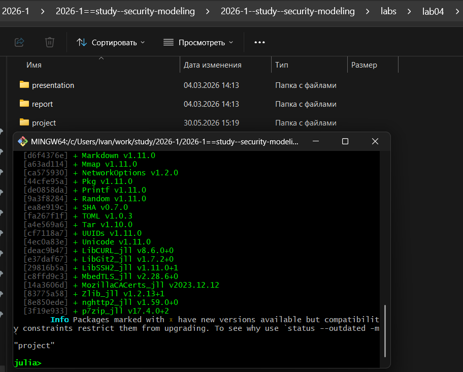
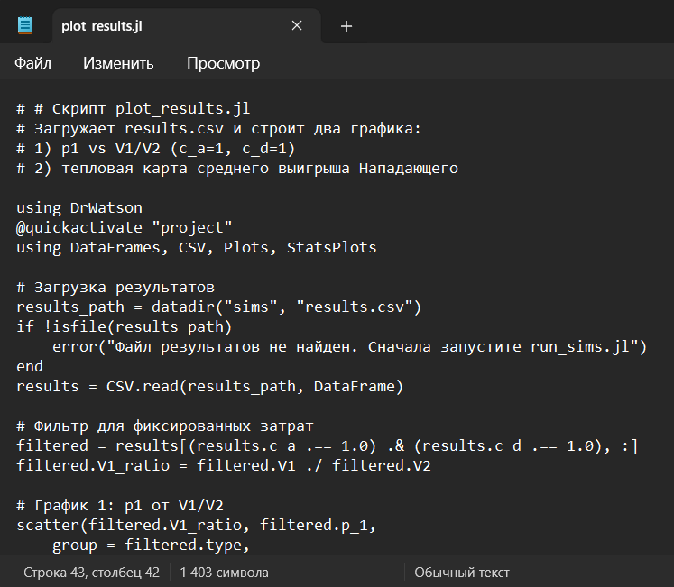
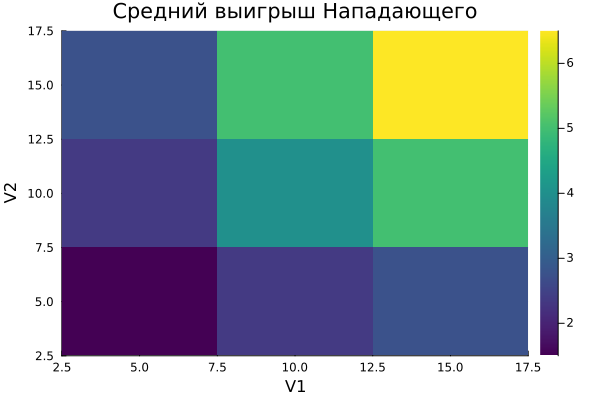
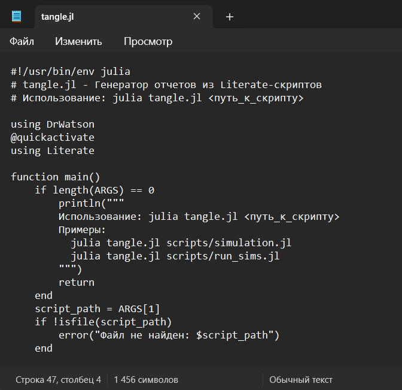

---
# Preamble

## Author
author:
  name: Махорин Иван Сергеевич
  degrees: BSc
  orcid: 0009-0005-2255-4025
  email: 1032259380@rudn.ru
  affiliation:
    - name: Российский университет дружбы народов
      country: Российская Федерация
      postal-code: 117198
      city: Москва
      address: ул. Миклухо-Маклая, д. 6
## Title
title: "Лабораторная работа №4"
subtitle: "Моделирование конфликта «Защитник–Нападающий»"
license: "CC BY"
date: 2026-05-30
## Generic options
lang: ru-RU
crossref:
  lof-title: Список иллюстраций
  lot-title: Список таблиц
  lol-title: Листинги
## Formats
format:
### Pdf output format
  beamer:
    toc: false
    toc-title: Содержание
    number-sections: true
    colorlinks: false
    toc-depth: 2
    slide_level: 2
    aspectratio: 169
    section-titles: true
    theme: metropolis
    themeoptions: progressbar=frametitle,sectionpage=progressbar,numbering=fraction
#### Language
    babel-lang: russian
    babel-otherlangs: english
### Html output
  revealjs:
    transition: slide
    margin: 0.2
    smaller: false
    output-ext: html
    theme: beige
    logo: _resources/image/logo_rudn.png
---

# Информация

## Докладчик

:::::::::::::: {.columns align=center}
::: {.column width="70%"}

  * Махорин Иван Сергеевич
  * студент группы НФИмд-02-25
  * Российский университет дружбы народов им. П. Лумумбы
  * [1032259380@rudn.ru](mailto:1032259380@rudn.ru)
  * <https://github.com/Ivan-Makhorin>

:::
::: {.column width="30%"}

:::
::::::::::::::

# Введение

## Цель работы

Освоить применение теории игр для анализа противостояния в сфере информационной безопасности. Научиться строить матричную игру, находить равновесие Нэша в чистых и смешанных стратегиях.

## Задачи лабораторной работы

1. Формализовать конфликт «Защитник–Нападающий» в виде антагонистической игры.
2. Реализовать на Julia функции расчёта платёжной матрицы, поиска равновесия Нэша и симуляции игры.
3. Визуализировать зависимость ожидаемого выигрыша и равновесных вероятностей от стоимости защиты и величины ущерба.

# Ход выполнения лабораторной работы

## Проект DrWatson

{#fig-001 width=40%}

## Установка пакетов

{#fig-002 width=40%}

## Написание скрипта

{#fig-003 width=40%}

## Написание скрипта

{#fig-004 width=40%}

## Написание скрипта

{#fig-005 width=40%}

## Выполнение скрипта

{#fig-006 width=50%}

## Выполнение скрипта

{#fig-007 width=40%}

# Ответы на контрольные вопросы

## Ответы на контрольные вопросы

1. **Что такое антагонистическая игра? Почему модель «Защитник–Нападающий» можно считать игрой с нулевой суммой?**

   Антагонистическая игра – это игра, в которой интересы игроков прямо противоположны: выигрыш одного равен проигрышу другого. В модели «Защитник–Нападающий» выигрыш Нападающего (ценность украденных данных) – это прямые потери Защитника, поэтому с точностью до постоянных затрат игра является игрой с нулевой суммой.

## Ответы на контрольные вопросы

2. **Дайте определение равновесия Нэша в чистых и смешанных стратегиях. Приведите пример, когда равновесия в чистых стратегиях не существует.**

   Равновесие Нэша – это набор стратегий, при котором ни один игрок не может улучшить свой выигрыш, изменив свою стратегию в одиночку.  
   - В **чистых** стратегиях каждый игрок всегда выбирает одно конкретное действие.  
   - В **смешанных** стратегиях игроки случайным образом выбирают действия с определёнными вероятностями.  

   Пример отсутствия чистого равновесия – игра «Орлянка»: если один игрок показывает «орла», а другой – «решку», то ни у кого нет однозначно лучшего ответа. В нашей модели равновесия в чистых стратегиях может не быть, например, при равных ценностях активов и нулевых затратах.

## Ответы на контрольные вопросы

3. **Как изменится равновесная стратегия защитника, если ущерб от успешной атаки на незащищённый сервер станет бесконечно большим?**

   Защитник будет вынужден всегда защищать этот сервер (чистая стратегия), даже если защита очень дорога. Нападающий, зная это, скорее всего, переключится на атаку другого актива (если он есть) или откажется от атаки.

## Ответы на контрольные вопросы

4. **Зачем в информационной безопасности применяют смешанные стратегии? Приведите реальные примеры рандомизации в защите.**

   Смешанные стратегии делают поведение защитника непредсказуемым, лишая атакующего возможности гарантированно выбрать слабозащищённую цель. Реальные примеры:  
   - Ротация honeypot-ловушек (случайное размещение обманок).  
   - Динамическое перераспределение IP-адресов (Moving Target Defense).  
   - Случайный выбор времени проверки логов или смены паролей.

# Генерация из литературного кода

## Написание скрипта

{#fig-008 width=30%}

## Выполнение скрипта

{#fig-009 width=70%}

## Выполнение скрипта

{#fig-010 width=70%}

## Выполнение скрипта

{#fig-011 width=70%}

## Проверка

{#fig-012 width=40%}

## Интеграция документации

{#fig-013 width=70%}

# Выводы

В ходе лабораторной работы реализована модель антагонистической игры «Защитник–Нападающий» с двумя активами. Разработаны функции для построения платёжных матриц, поиска равновесия Нэша (чистого и смешанного) и параметрического сканирования.

Проведён расчёт равновесных стратегий и ожидаемых выигрышей для всех комбинаций ценностей активов и затрат. Построенные графики показывают, как вероятность атаки на первый актив зависит от соотношения его ценности к ценности второго, и как меняется средний выигрыш Нападающего в зависимости от ценностей активов.

Результаты подтверждают теоретические положения теории игр: при симметричных активах и нулевых затратах равновесие смешанное (вероятности близки к половине), при сильной асимметрии возникает чистое равновесие. Модель позволяет анализировать стратегии защиты информационных систем и находить оптимальные решения в условиях противодействия.

# Список литературы

1. JuliaLang [Электронный ресурс]. 2026 JuliaLang.org contributors. URL: https: //julialang.org/ (дата обращения: 02.04.2026).
2. Julia 1.12 Documentation [Электронный ресурс]. 2026 JuliaLang.org contributors. URL: https://docs.julialang.org/en/v1/ (дата обращения: 02.04.2026).