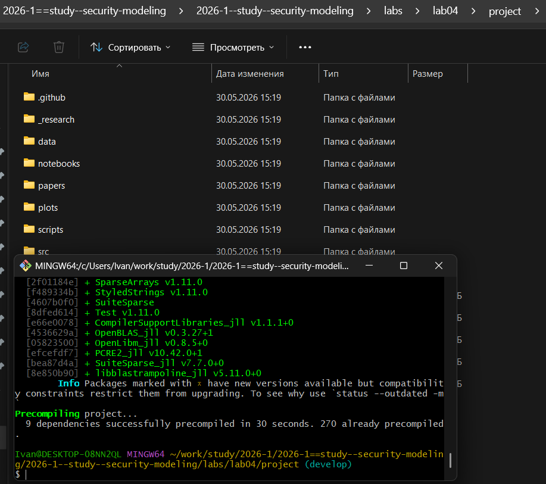
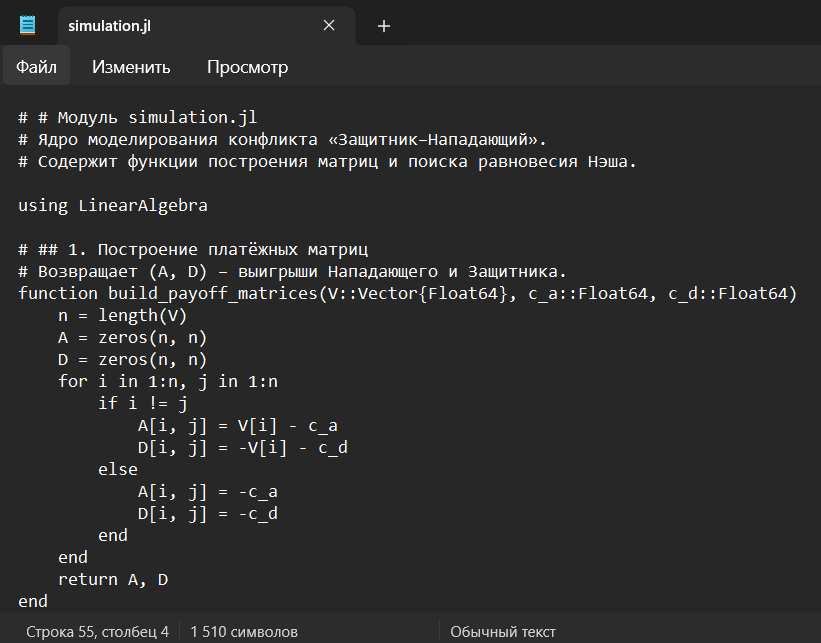
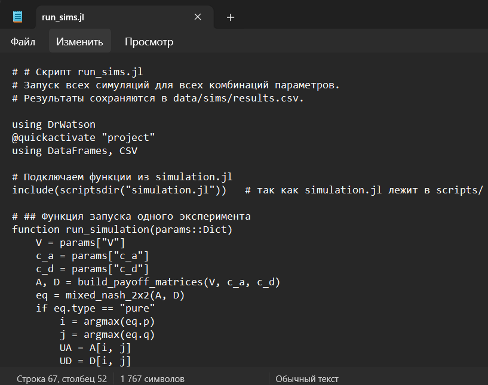
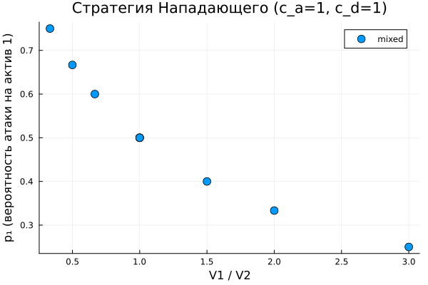
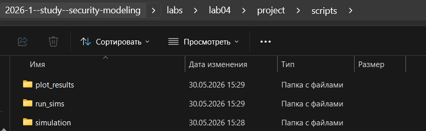
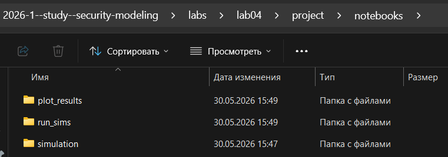
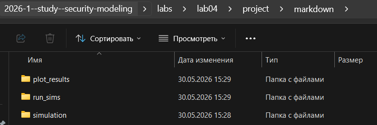
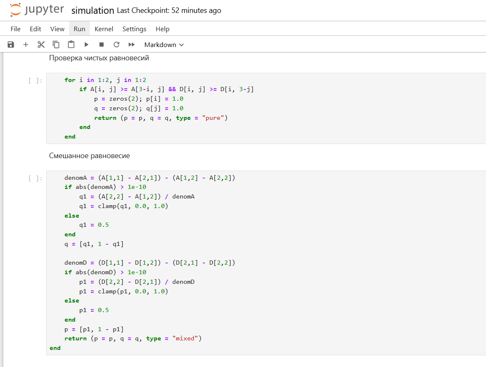
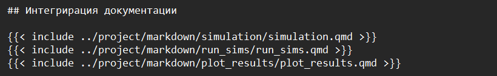

---
## Author
author:
  name: Махорин Иван Сергеевич
  degrees: BSc
  orcid: 0000-0002-0877-7063
  email: 1032259380@rudn.ru
  affiliation:
    - name: Российский университет дружбы народов
      country: Российская Федерация
      postal-code: 117198
      city: Москва
      address: ул. Миклухо-Маклая, д. 6

## Title
title: "Отчёт по лабораторной работе №4"
subtitle: "Моделирование конфликта «Защитник–Нападающий»"
license: "CC BY"
bibliography: bib/cite.bib
nocite: |
  @*
---

# Цель работы

Освоить применение теории игр для анализа противостояния в сфере информационной безопасности. Научиться строить матричную игру, находить равновесие Нэша в чистых и смешанных стратегиях.

# Задание

### Задачи лабораторной работы

1. Формализовать конфликт «Защитник–Нападающий» в виде антагонистической игры.
2. Реализовать на Julia функции расчёта платёжной матрицы, поиска равновесия Нэша и симуляции игры.
3. Визуализировать зависимость ожидаемого выигрыша и равновесных вероятностей от стоимости защиты и величины ущерба.

# Теоретическое введение

## Теоретические сведения

Вот краткие теоретические сведения с правильно оформленными формулами для отчёта в формате Markdown:

## Теоретические сведения

Конфликт между Защитником и Нападающим описывается с помощью теории игр. Это позволяет формально определить наилучшие действия каждой стороны в условиях противодействия.

- **Игроки**: Защитник (стремится минимизировать ущерб) и Нападающий (стремится максимизировать свой выигрыш).
- **Стратегии**: действия, доступные игрокам. У каждого есть два варианта – атаковать или защищать один из двух активов (чистые стратегии). Также можно случайным образом выбирать актив (смешанные стратегии).
- **Выигрыш**: численный результат, который получает каждый игрок в зависимости от выбранных стратегий. Если атака попадает на незащищённый актив – Нападающий получает его ценность (минус свои затраты), а Защитник несёт убыток. Если атака отражена – Нападающий только теряет затраты на атаку, Защитник теряет только затраты на защиту.

### Равновесие Нэша

Это ситуация, когда ни один из игроков не может улучшить свой результат, изменяя свою стратегию в одиночку. Равновесие может быть:

- **В чистых стратегиях**: каждый игрок всегда выбирает одно и то же действие (например, всегда атаковать первый актив).
- **В смешанных стратегиях**: игроки случайным образом выбирают действия с определёнными вероятностями, чтобы сделать своё поведение непредсказуемым для противника.

### Как меняется равновесие в зависимости от параметров

- Если ценности активов сильно различаются, Нападающий будет целенаправленно атаковать более ценный актив, а Защитник – защищать его.
- Если защита стоит очень дорого, Защитнику может быть выгоднее с некоторой вероятностью защищать более дешёвый актив, провоцируя атаку на него.
- Если атака стоит дорого, Нападающий становится осторожнее и атакует только при достаточно высокой вероятности успеха.

### Применение в информационной безопасности

- Смешанные стратегии защиты на практике реализуются через непредсказуемое распределение ресурсов (например, ротация систем обнаружения атак, случайный выбор honeypot-ловушек).
- Равновесие Нэша даёт гарантированный минимаксный результат – минимальный максимальный ущерб, который Защитник может обеспечить в условиях разумного противника.

# Выполнение лабораторной работы

Для начала создадим проект DrWatson с именем project в папке lab04 ([рис. @fig-001]):

{#fig-001 width=70%}

После этого установим все необходимые пакеты ([рис. @fig-002]): 

{#fig-002 width=70%}

Теперь приступим к выполнению практических заданий из лабораторной работы.

В первую очередь создадим файл со скриптом, который строит две платёжные матрицы игры размера $n \times n$ (где $n$ – число активов, длина вектора $V$) ([рис. @fig-003]):

{#fig-003 width=70%}

Напишем скрипт, запускающий симуляции ([рис. @fig-004]):

{#fig-004 width=70%}

Далее создадим файл для построения графиков по сохранённым результатам ([рис. @fig-005]):

{#fig-005 width=70%}

Выполним скрипты и просмотрим визуализацию результатов ([рис. @fig-006] - [рис. @fig-007]):

{#fig-006 width=70%}

{#fig-007 width=70%}

# Ответы на контрольные вопросы

### Ответы на контрольные вопросы

1. **Что такое антагонистическая игра? Почему модель «Защитник–Нападающий» можно считать игрой с нулевой суммой?**

   Антагонистическая игра – это игра, в которой интересы игроков прямо противоположны: выигрыш одного равен проигрышу другого. В модели «Защитник–Нападающий» выигрыш Нападающего (ценность украденных данных) – это прямые потери Защитника, поэтому с точностью до постоянных затрат игра является игрой с нулевой суммой.

2. **Дайте определение равновесия Нэша в чистых и смешанных стратегиях. Приведите пример, когда равновесия в чистых стратегиях не существует.**

   Равновесие Нэша – это набор стратегий, при котором ни один игрок не может улучшить свой выигрыш, изменив свою стратегию в одиночку.  
   - В **чистых** стратегиях каждый игрок всегда выбирает одно конкретное действие.  
   - В **смешанных** стратегиях игроки случайным образом выбирают действия с определёнными вероятностями.  

   Пример отсутствия чистого равновесия – игра «Орлянка»: если один игрок показывает «орла», а другой – «решку», то ни у кого нет однозначно лучшего ответа. В нашей модели равновесия в чистых стратегиях может не быть, например, при равных ценностях активов и нулевых затратах.

3. **Как изменится равновесная стратегия защитника, если ущерб от успешной атаки на незащищённый сервер станет бесконечно большим?**

   Защитник будет вынужден всегда защищать этот сервер (чистая стратегия), даже если защита очень дорога. Нападающий, зная это, скорее всего, переключится на атаку другого актива (если он есть) или откажется от атаки.

4. **Зачем в информационной безопасности применяют смешанные стратегии? Приведите реальные примеры рандомизации в защите.**

   Смешанные стратегии делают поведение защитника непредсказуемым, лишая атакующего возможности гарантированно выбрать слабозащищённую цель. Реальные примеры:  
   - Ротация honeypot-ловушек (случайное размещение обманок).  
   - Динамическое перераспределение IP-адресов (Moving Target Defense).  
   - Случайный выбор времени проверки логов или смены паролей.

# Генерация из литературного кода

Выполним генерацию по всем скриптам из литературного кода в чистый код, jupyter notebook, а также в документацию в формате Quarto. Для удобства возьмём скрипт из первой лабораторной работы ([рис. @fig-008]):

{#fig-008 width=70%}

Запустим скрипт и проверим результат ([рис. @fig-009] - [рис. @fig-011]):

{#fig-009 width=70%}

{#fig-010 width=70%}

{#fig-011 width=70%}

Затем выполним код для всех файлов из jupyter notebook для контрольной проверки ([рис. @fig-012]):

{#fig-012 width=70%}

В конце интегрируем документацию в формате Quarto в отчёт ([рис. @fig-013]):

{#fig-013 width=70%}

## Интегрирация документации




# Выводы

## Выводы

В ходе лабораторной работы реализована модель антагонистической игры «Защитник–Нападающий» с двумя активами. Разработаны функции для построения платёжных матриц, поиска равновесия Нэша (чистого и смешанного) и параметрического сканирования.

Проведён расчёт равновесных стратегий и ожидаемых выигрышей для всех комбинаций ценностей активов и затрат. Построенные графики показывают, как вероятность атаки на первый актив зависит от соотношения его ценности к ценности второго, и как меняется средний выигрыш Нападающего в зависимости от ценностей активов.

Результаты подтверждают теоретические положения теории игр: при симметричных активах и нулевых затратах равновесие смешанное (вероятности близки к половине), при сильной асимметрии возникает чистое равновесие. Модель позволяет анализировать стратегии защиты информационных систем и находить оптимальные решения в условиях противодействия.

# Список литературы{.unnumbered}

::: {#refs}
:::
